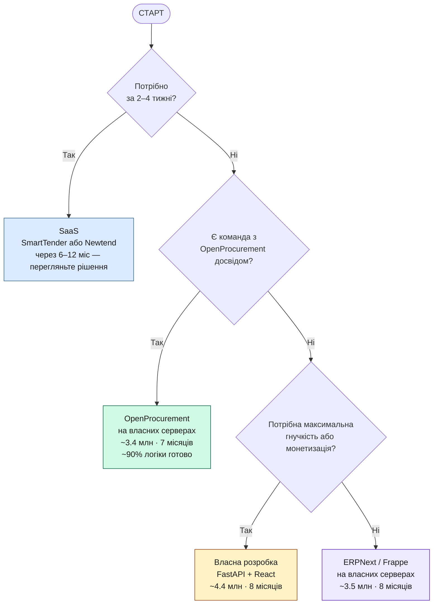
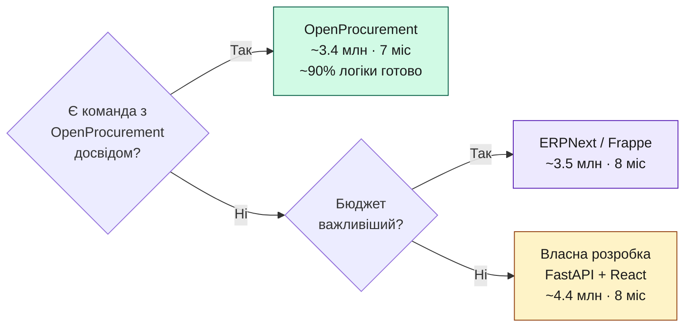

# Аналіз ринку систем електронних закупівель в Україні

**Версія:** 1.0  
**Дата:** 2026-05-28  
**Призначення:** Дослідження існуючих рішень та обґрунтування вибору підходу для Ecooptima

---

## 1. Контекст та мета аналізу

Ecooptima потребує системи для проведення конкурентних закупівель обладнання серед кількох постачальників. Перед тим як ухвалити рішення про власну розробку, необхідно:

1. Зрозуміти, які платформи вже існують на ринку України.
2. Оцінити їх придатність як SaaS-рішення для приватної компанії.
3. Порівняти підходи «готове SaaS рішення» vs. «власна розробка».
4. Дати рекомендацію.

---

## 2. Огляд існуючих систем

### 2.1 Prozorro (prozorro.gov.ua)

**Тип:** Державна публічна платформа електронних закупівель  
**Власник:** Мінекономіки України / ДП «Прозорро»  
**Запущена:** 2016 рік

#### Опис
Prozorro — центральна база даних і API-шлюз, до якого підключені авторизовані майданчики (Prozorro-авторизовані електронні торгові системи, наприклад Zakupki.prom.ua, PROZORRO.gov, SmartTender тощо). Використовується для закупівель коштів державного та комунального бюджету.

#### Ключові можливості
- Відкриті тендери, спрощені закупівлі, рамкові угоди.
- Зворотний аукціон у режимі реального часу.
- Відкриті дані — всі тендери публічні.
- Класифікатор CPV / ДК 021:2015.
- Інтеграція з Дія.Підпис / КЕП.

#### Застосовність для Ecooptima
| Критерій | Оцінка |
|----------|--------|
| Обов'язковість | Використання Prozorro обов'язкове лише для розпорядників державних коштів. Ecooptima як приватна компанія не зобов'язана, але може добровільно. |
| Конфіденційність | Усі тендери — публічні. Не підходить, якщо компанія хоче зберегти комерційну таємницю. |
| Гнучкість налаштувань | Мінімальна. Процедури строго регламентовані законом. |
| Вартість | Безкоштовна платформа; майданчики беруть комісію ~0.1–0.3% від суми договору. |
| **Висновок** | **Частково підходить** — лише якщо Ecooptima готова до повної публічності процесу закупівель. |

---

### 2.2 SmartTender (smarttender.biz)

**Тип:** Комерційна SaaS-платформа для проведення тендерів  
**Власник:** ТОВ «Смарт Тендер», Україна  
**Запущена:** ~2015 рік

#### Опис
Один із найпопулярніших в Україні комерційних тендерних майданчиків. Підтримує як державні закупівлі (Prozorro-авторизований майданчик), так і корпоративні закупівлі для приватних компаній. Використовується ДТЕК, «Укрпошта», приватними компаніями.

#### Ключові можливості
- Корпоративний модуль (для приватних закупівель поза Prozorro).
- Зворотні аукціони в режимі реального часу.
- Мультикритеріальна оцінка.
- Управління постачальниками (реєстр, кваліфікація).
- Аналітика та звіти.
- Інтеграція з SAP, 1С (частково).
- Мобільний застосунок.

#### Застосовність для Ecooptima
| Критерій | Оцінка |
|----------|--------|
| Функціональність | Висока — покриває більшість вимог з FR-01 по FR-17. |
| Конфіденційність | Корпоративні тендери можуть бути приватними. |
| Кастомізація | Обмежена — лише налаштування в межах платформи. |
| Вартість (орієнтовно) | Від 15,000 до 80,000 грн/рік залежно від пакету + комісія 0.1–0.2% з угоди. |
| Підтримка | Є, але не виключна — ви один із тисяч клієнтів. |
| Локалізація | Українська мова, відповідність законодавству. |
| **Висновок** | **Добрий кандидат для швидкого старту.** Слід запросити демо та деталі тарифів. |

---

### 2.3 Newtend (newtend.com)

**Тип:** Комерційна SaaS-платформа  
**Власник:** ТОВ «Нью Тенд», Україна  
**Запущена:** ~2016 рік

#### Опис
Авторизований майданчик Prozorro, також надає корпоративні закупівлі для приватних компаній. Активно використовується в енергетичному та промисловому секторах.

#### Ключові можливості
- Корпоративні та державні тендери.
- Зворотні аукціони.
- Управління специфікаціями та документацією.
- Інтеграція з бухгалтерськими системами.
- Звіти та аналітика.

#### Застосовність для Ecooptima
| Критерій | Оцінка |
|----------|--------|
| Функціональність | Середня-висока. |
| Галузева спеціалізація | Є досвід роботи з енергетичними компаніями. |
| Вартість | Подібна до SmartTender. |
| **Висновок** | **Гідна альтернатива SmartTender.** Варто порівняти умови. |

---

### 2.4 Zakupki.prom.ua (закупки.проіт.ua)

**Тип:** Тендерний майданчик від Prom.ua (EVO Company)  
**Власник:** EVO (раніше Rozetka group)

#### Опис
Великий авторизований майданчик Prozorro. Переважно орієнтований на державні закупівлі. Корпоративний модуль для приватних компаній менш розвинений порівняно зі SmartTender.

#### Застосовність для Ecooptima
| Критерій | Оцінка |
|----------|--------|
| Функціональність для приватних закупівель | Нижча, ніж у SmartTender. |
| **Висновок** | **Не рекомендується** як основне рішення для корпоративних закупівель. |

---

### 2.5 Тorgiдея / TenderPro та інші нішеві платформи

В Україні існує ще кілька дрібніших майданчиків, але вони або є Prozorro-авторизованими без виділеного корпоративного модуля, або мають малу базу постачальників. Для Ecooptima вони менш релевантні.

---

### 2.6 Міжнародні SaaS рішення

| Платформа | Країна | Застосовність |
|-----------|--------|--------------|
| **Jaggaer (раніше BravoSolution)** | США | Потужне корпоративне рішення, але надмірне та дороге для потреб Ecooptima (від $50K/рік). |
| **Coupa** | США | Аналогічно — корпоративний клас, не підходить за ціною та складністю впровадження. |
| **Mercateo / Unite** | Німеччина | Орієнтований на B2B-маркетплейс, не тендерна платформа. |
| **Ivalua** | Франція | Enterprise, не підходить. |
| **Тendеrsеarch.io** | — | Агрегатор тендерів, не платформа для проведення. |

**Висновок:** Міжнародні enterprise-платформи надмірні за функціональністю та вартістю. Їх впровадження в Україні потребує значних зусиль з адаптації до місцевого законодавства та практик.

---

## 3. Зведена таблиця порівняння

| Критерій | Prozorro | SmartTender | Newtend | Відкритий код (Frappe) | Власна розробка |
|----------|:--------:|:-----------:|:-------:|:--------------------:|:---------------:|
| **Вартість початкова** | Низька | Середня | Середня | Висока (~3.5 млн) | Висока (~4.4 млн) |
| **Вартість щорічна** | Комісія з угоди | Абонплата + комісія | Абонплата + комісія | Підтримка (хостинг — 0\*) | Підтримка (хостинг — 0\*) |
| **TCO 5 років (Ecooptima)** | ~0.6 млн | ~0.6 млн | ~0.6 млн | ~4.7 млн | ~6.0 млн |
| **Час до запуску** | 1–2 тижні | 1–4 тижні | 1–4 тижні | 8 місяців | 8 місяців |
| **Кастомізація** | Немає | Обмежена | Обмежена | Висока | Повна |
| **Конфіденційність** | Публічна | Приватний режим | Приватний режим | Повна | Повна |
| **Інтеграція з ERP** | Обмежена | Часткова | Часткова | Висока (Frappe є ERP) | Будь-яка |
| **Контроль даних** | На платформі | На платформі | На платформі | Повний | Повний |
| **База постачальників** | Дуже велика | Велика | Середня | Треба будувати | Треба будувати |
| **Підтримка КЕП** | Так | Так | Так | Потребує інтеграції | Потребує інтеграції |
| **Мобільна версія** | Часткова | Є | Часткова | Вбудована (Frappe) | За вибором |
| **Галузева кастомізація** | Немає | Мінімальна | Мінімальна | Висока | Повна |
| **Залежність від вендора** | Висока | Висока | Висока | Мінімальна (MIT) | Відсутня |
| **Ризик закриття** | Низький | Середній | Середній | Відсутній | Відсутній |
| **Аукціон у реальному часі** | Так | Так | Так | Frappe Realtime | З нуля |
| **Закрита пропозиція** | Так | Так | Так | Розробляється | Розробляється |
| **Специфіка енергетики** | Немає | Базова | Базова | Вбудовується | Вбудовується |

*\* Ecooptima має власну серверну інфраструктуру — хостинг безкоштовний. TCO наведено з урахуванням цього.*

---

## 4. Детальний аналіз: SaaS vs Власна розробка

### 4.1 Аргументи на користь SaaS (SmartTender / Newtend)

**Переваги:**

- **Швидкий старт:** Система вже готова. За 2–4 тижні можна провести перший тендер.
- **Готова база постачальників:** Платформа вже має тисячі зареєстрованих постачальників — деякі з них вже можуть бути партнерами Ecooptima.
- **Немає потреби в IT-команді:** Розробка, хостинг, оновлення — відповідальність платформи.
- **Відповідність законодавству:** Платформа оновлюється відповідно до змін у законах.
- **Перевірений продукт:** Тисячі компаній вже використовують ці системи.
- **Підтримка КЕП "з коробки":** Не потрібно самостійно інтегрувати ЦСК.

**Недоліки:**

- **Обмежена кастомізація:** Неможливо адаптувати процеси точно під внутрішні регламенти Ecooptima.
- **Постійні виплати:** Абонплата та комісія з кожної угоди назавжди.
- **Дані на чужій платформі:** Ви не контролюєте де і як зберігаються ваші комерційні дані.
- **Залежність від вендора:** Якщо платформа змінить умови або закриється — ризик переходу.
- **Немає специфіки галузі:** Класифікатори та поля — загальні, не оптимізовані під енергетичне обладнання.

---

### 4.2 Аргументи на користь власної розробки

**Переваги:**

- **Повна кастомізація:** Процеси, поля, звіти — точно під вимоги Ecooptima.
- **Галузева специфіка:** Можливість вбудувати класифікатор обладнання, технічні параметри (потужність, напруга, клас захисту тощо).
- **Повний контроль даних:** Сервер в Україні або вашій хмарі — ніхто не має доступу до ваших комерційних даних.
- **Відсутність щорічних платежів вендору:** Після розробки — тільки хостинг і підтримка.
- **Можливість монетизації:** У майбутньому систему можна відкрити для інших приватних компаній або галузевих асоціацій.
- **Конкурентна перевага:** Унікальний інструмент, адаптований під стратегію закупівель.

**Недоліки:**

- **Час і гроші на розробку:** Перша версія — від 3 до 6 місяців і від 500,000 до 2,000,000 грн залежно від команди.
- **Потрібна IT-команда:** власна команда розробки для впровадження та підтримки.
- **Ризик якості:** Власна розробка може мати баги та недопрацювання, яких немає в зрілих SaaS.
- **Мала база постачальників:** Потрібно самостійно залучати постачальників і наповнювати реєстр.
- **Відповідальність за безпеку:** Ви відповідаєте за захист даних, резервні копії, оновлення.

---

## 5. Оцінка доцільності власної розробки

### 5.1 Фінансова модель

**Сценарій A: SmartTender (SaaS)**

- Абонплата: ~40,000 грн/рік (приблизна оцінка для середнього пакету)
- Комісія з угод: 0.15% від суми закупівель
- Якщо річний обсяг закупівель = 50 млн грн → комісія ≈ 75,000 грн/рік
- **Загальна вартість за 5 років ≈ 575,000 грн** (без урахування зростання абонплати)

**Сценарій B: Власна розробка або Відкритий код (на власних серверах)**

> **Важливо для Ecooptima:** компанія має власну серверну інфраструктуру та команду супроводу. Хостинг та обслуговування серверів — **безкоштовні**. Це принципово змінює TCO-розрахунок порівняно зі сторонніми компаніями.

- Розробка першої версії силами внутрішньої команди: трудовитрати ~1,260–2,200 людино-годин (залежно від підходу)
- Хостинг + ops: **0 грн/рік** (власна інфраструктура)
- Підтримка та розвиток: ~200,000 – 400,000 грн/рік
- **Загальна вартість за 5 років: ~4,000,000 – 6,400,000 грн**
- **Беззбитковість відносно SaaS:** ~4–6 років при обсязі 50 млн грн/рік *(замість 8–12 без власної інфраструктури)*

**Сценарій C: OpenProcurement (на власних серверах)**

- Розробка та адаптація: ~2,800,000 грн
- Хостинг: **0 грн/рік** (власна інфраструктура)
- Підтримка: ~200,000 – 300,000 грн/рік
- **Загальна вартість за 5 років: ~3,800,000 – 4,300,000 грн**
- **Беззбитковість відносно SaaS: ~3–4 роки** — найшвидша окупність

**Висновок фінансового аналізу:**
З урахуванням власної інфраструктури Ecooptima, **власна розробка або відкритий код на на власних серверах є фінансово вигідними вже з 3–4 року**. SaaS виправданий лише як стартова фаза для накопичення досвіду, а не як довгострокове рішення.

---

### 5.2 Матриця рішень

| Фактор | Вага | SaaS | Відкритий код (на серверах) | Власна розробка (на серверах) |
|--------|:----:|:----:|:---------------------:|:----------------:|
| Швидкість запуску | 20% | 9/10 | 5/10 | 4/10 |
| Вартість TCO 5 років* | 25% | 5/10 | **9/10** | 7/10 |
| Функціональність | 20% | 7/10 | **9/10** | **9/10** |
| Кастомізація | 15% | 4/10 | 8/10 | **10/10** |
| Безпека даних | 10% | 6/10 | **10/10** | **10/10** |
| Масштабованість | 10% | 7/10 | 8/10 | **9/10** |
| **Зважений підсумок** | 100% | **6.45** | **8.10** | **7.80** |

*\* З урахуванням безкоштовної на власних серверах інфраструктури Ecooptima.*

**З власною інфраструктурою OpenProcurement на власних серверах стає явним лідером за TCO.**

---

## 6. Вибір підходу: коли що обирати

### 6.1 Чотири підходи — коротко

| | SaaS | OpenProcurement | ERPNext/Frappe | Власна розробка |
|-|:----:|:---------------:|:--------------:|:------------:|
| **Суть** | Орендуємо готову платформу | Адаптуємо Prozorro-ядро | Будуємо на загальному ERP-фреймворку | Пишемо з нуля на FastAPI/React |
| **Тендерна логіка** | Готова | Готова (~90%) | Пишемо з нуля | Пишемо з нуля |
| **Вартість старту** | 0 | ~2.8 млн грн | ~3.5 млн грн | ~4.4 млн грн |
| **Хостинг (Ecooptima)** | Не застосовно | **0 грн** (власн. серв.) | **0 грн** (власн. серв.) | **0 грн** (власн. серв.) |
| **Час до першого тендеру** | 1–4 тижні | 5–6 місяців | 8 місяців | 8 місяців |
| **Кастомізація** | Мінімальна | Висока | Висока | Максимальна |
| **Контроль даних** | Частковий | Повний | Повний | Повний |
| **Детальна пропозиція** | — | «Пропозиція на основі OpenProcurement» | «Пропозиція на основі ERPNext/Frappe» | «Пропозиція власної розробки» |

---

### 6.2 Підхід A: SaaS (SmartTender / Newtend)

**Обирайте якщо:**

- Потрібно провести перші тендери вже через 2–4 тижні.
- Немає бюджету або команди для власної розробки прямо зараз.
- Невідомо, чи реально процес закупівель стане регулярним.
- Хочете перевірити ідею та навчити команду без ризику.

**Не обирайте якщо:**

- Потрібні конфіденційні тендери без витоку цін конкурентам через платформу.
- Потрібна галузева специфіка (власний класифікатор енергообладнання, технічні параметри).
- Річний обсяг закупівель перевищує 100 млн грн (комісія 0.15% = 150,000 грн/рік тільки за використання).
- Потрібна інтеграція з внутрішніми системами (ERP, SCADA, обліковою системою).

**TCO (5 років, обсяг 50 млн грн/рік):**

- Абонплата: ~200,000 грн
- Комісія: ~375,000 грн
- **Разом: ~575,000 грн** — найдешевший варіант у короткостроковій перспективі

---

### 6.3 Підхід B: OpenProcurement (адаптований)

**Обирайте якщо:**

- Маєте або можете знайти команду з досвідом Prozorro-стека (Python/Pyramid + CouchDB).
- Потрібна максимальна економія часу розробки (5–6 місяців vs 8 місяців для інших).
- Важлива відповідність до принципів Prozorro (прозорість, аукціон, sealed bid — вже реалізовані).
- Є власна інфраструктура (хостинг безкоштовний — суттєво покращує TCO).
- Бюджет на розробку обмежений — хочете найдешевший варіант (~2.8 млн грн).

**Не обирайте якщо:**

- Не вдається знайти OpenProcurement-розробників — ринок вузький (~50–100 в Україні).
- Команда категорично проти CouchDB і немає ресурсів на міграцію (~160 год).
- Потрібен дуже специфічний UI — доведеться будувати з нуля (OpenProcurement — тільки API).
- Потрібна ERP-інтеграція — OpenProcurement не є ERP.

**TCO (5 років, на власних серверах Ecooptima):**

- Розробка: ~2,800,000 грн
- Хостинг: 0 грн
- Підтримка: ~1,000,000 грн
- **Разом: ~3,800,000 грн** — найдешевший власний варіант

---

### 6.4 Підхід C: ERPNext / Frappe (адаптований)

**Обирайте якщо:**

- OpenProcurement-команду знайти не вдається.
- Важливий широкий ринок розробників (будь-який Python/Vue-девелопер).
- Розглядаєте розширення до повноцінної ERP у майбутньому.
- Потрібна MIT-ліцензія без будь-яких юридичних обмежень.
- Є власна інфраструктура (хостинг безкоштовний).

**Не обирайте якщо:**

- Потрібен найшвидший старт — Frappe потребує онбордингу команди.
- Команда вже знає OpenProcurement — тоді краще підхід B.
- Потрібна максимальна гнучкість UI без обмежень Frappe-шаблонів.

**TCO (5 років, на власних серверах Ecooptima):**

- Розробка: ~3,500,000 грн
- Хостинг: 0 грн
- Підтримка: ~1,200,000 грн
- **Разом: ~4,700,000 грн**

---

### 6.5 Підхід D: Власна розробка (FastAPI + React)

**Обирайте якщо:**

- Потрібна максимальна гнучкість — жодних компромісів у архітектурі та UI.
- Є плани монетизувати платформу або відкрити іншим компаніям галузі.
- Команда категорично проти будь-яких фреймворкових обмежень.
- Потрібні глибокі інтеграції з SCADA, ERP, обліковими системами.
- Є власна інфраструктура (хостинг безкоштовний).

**Не обирайте якщо:**

- Бюджет обмежений — це найдорожчий варіант.
- Немає досвіду управління складними розробками — ризик перевитрат часу.

**TCO (5 років, на власних серверах Ecooptima):**

- Розробка: ~4,400,000 грн
- Хостинг: 0 грн
- Підтримка: ~1,600,000 грн
- **Разом: ~6,000,000 грн** — найдорожчий варіант

---

### 6.6 TCO-порівняння (5 років, Ecooptima з на власних серверах)

| | SaaS | OpenProcurement | ERPNext/Frappe | Власна розробка |
|-|:----:|:---------------:|:--------------:|:------------:|
| Розробка | 0 | ~2,800,000 | ~3,500,000 | ~4,400,000 |
| Хостинг 5 р. | ~575,000 | **0** | **0** | **0** |
| Підтримка 5 р. | 0 | ~1,000,000 | ~1,200,000 | ~1,600,000 |
| **TCO 5 років** | **~575,000** | **~3,800,000** | **~4,700,000** | **~6,000,000** |
| Окупність vs SaaS | — | ~6 р.\* | ~8 р.\* | ~10 р.\* |

*\* Окупність розрахована з умовою, що SaaS-комісія зростає разом з обсягом закупівель.*

> **Якщо обсяг закупівель > 100 млн грн/рік**, SaaS-комісія (0.15%) складає 150,000 грн/рік. Окупність OpenProcurement скорочується до ~3–4 років.

---

### 6.7 Дерево рішень

---

### 6.8 Рекомендована стратегія для Ecooptima

З урахуванням **безкоштовної на власних серверах інфраструктури** та того, що SaaS-платформи (SmartTender, Newtend) побудовані саме на OpenProcurement:

1. **Місяці 1–3:** Запустити SaaS для першого досвіду. Паралельно — провести discovery з 2–3 командами, що мають OpenProcurement-досвід.
2. **Місяць 3:** Якщо знайдена OpenProcurement-команда → підписати контракт на адаптацію.
3. **Місяці 4–9:** Розробка на OpenProcurement на власних серверах.
4. **Місяць 10:** Запуск власної платформи → відмова від SaaS.

**Очікувана економія vs SaaS протягом 10 років: ~2,000,000 грн+** (відсутність комісій при зростанні обсягів).

---

## 7. Порівняння фреймворк відкритого кодуів

Детальні пропозиції по підходах на основі відкритого коду:

- **OpenProcurement** (ядро Prozorro, ~90% логіки готово) — «Пропозиція на основі OpenProcurement»
- **ERPNext/Frappe** (загальний ERP-фреймворк) — «Пропозиція на основі ERPNext/Frappe»

### 7.0 Зв'язок між комерційними продуктами та Платформа відкритого кодуми

Ключовий факт: більшість комерційних SaaS-платформ, розглянутих у розділі 2, побудовані на тих самих рушіях відкритого коду.

| Комерційний продукт | Платформа з відкритим кодом | Що додано комерційно |
|---------------------|--------------------|----------------------|
| **[Prozorro](https://prozorro.gov.ua)** | OpenProcurement API (100%) | UI, інтеграції з держ. реєстрами, підтримка |
| **[SmartTender](https://smarttender.biz)** | OpenProcurement API (ядро) | Власний UI, корпоративний модуль, мобільний застосунок |
| **[Newtend](https://newtend.com)** | OpenProcurement API (ядро) | Власний UI, галузеві функції, підтримка |
| **[Zakupki.prom.ua](https://zakupki.prom.ua)** | OpenProcurement API (ядро) | Інтеграція з маркетплейсом Prom.ua |
| **Odoo Enterprise** | Odoo Community (100%) | Платні модулі (Sign, Accounting+), SLA-підтримка, Odoo.sh хостинг |
| **Frappe Cloud** | ERPNext / Frappe (100%) | Managed hosting, SLA, бекапи, SSL |
| **Jaggaer / Coupa** | Власні закриті ядра | — |

> **Висновок:** SmartTender і Newtend — це по суті комерційні надбудови над OpenProcurement. Ecooptima може побудувати аналогічну надбудову для власних потреб, використавши те саме ядро. Це підтверджує, що OpenProcurement є найближчим до вимог платформи.

---

### 7.1 OpenProcurement (Prozorro Stack) ⭐ Найближче до домену

**Репозиторій:** github.com/ProzorroUKR/openprocurement.api  
**Мова:** Python 3, Pyramid  
**База даних:** CouchDB (основна) / PostgreSQL (часткова підтримка)  
**Ліцензія:** Apache 2.0  
**Комерційні продукти на цій основі:** Prozorro, SmartTender, Newtend, Zakupki.prom.ua

#### Що вбудовано (~90% тендерної логіки)

| Компонент | Статус |
|-----------|--------|
| Тендерна стан-машина (DRAFT → ACTIVE → … → COMPLETE) | ✅ Повністю |
| Управління лотами та специфікаціями | ✅ Повністю |
| Подання та розкриття пропозицій (sealed bid) | ✅ Повністю |
| Зворотній аукціон у реальному часі | ✅ Повністю |
| Мультикритеріальна оцінка пропозицій | ✅ Повністю |
| Журнал аудиту (незмінний) | ✅ Повністю |
| REST API (OpenAPI) | ✅ Повністю |
| Q&A (запитання та роз'яснення) | ✅ Повністю |
| Email-сповіщення | ✅ Є |
| Управління постачальниками | ⚠️ Часткове |
| UI (адмін + портал постачальника) | ❌ Відсутній — лише API |
| Конфіденційні (приватні) тендери | ⚠️ Потребує відключення central DB |
| Auth / Ролі | ⚠️ Базово (JWT, зовнішній сервіс) |

#### Що потрібно розробити (~1,260 год)

| Компонент | Год |
|-----------|:---:|
| Адмін-панель та портал постачальника (React) | ~440 |
| Auth сервіс (JWT, 2FA, ролі) | ~120 |
| Email-сервіс (шаблони, черга) | ~60 |
| Відключення публічності / перехід на standalone | ~80 |
| Міграція CouchDB → PostgreSQL | ~160 |
| Генерація договорів, аналітика, звіти | ~160 |
| QA, DevOps, документація | ~240 |
| **Разом** | **~1,260** |

> Порівняно з ~2,200 год для custom build — **економія ~43%** (~940 год).

#### Застосовність для Ecooptima
| Критерій | Оцінка |
|----------|--------|
| Покриття тендерної логіки | ✅ ~90% вже реалізовано |
| Вартість розробки | ✅ ~2.8 млн грн — найдешевший варіант |
| Час до першої версії | ✅ 5–6 місяців |
| Доступність розробників (UA) | ⚠️ Вузький ринок (~50–100 фахівців), але вони є |
| CouchDB | ⚠️ Нестандартна БД, потрібна міграція (~160 год) |
| UI | ⚠️ Потрібно будувати з нуля |
| Конфіденційність | ⚠️ Потрібно відключити central Prozorro DB |
| **Висновок** | **Найдешевший і найшвидший варіант. Рекомендується за наявності команди з OpenProcurement досвідом.** |

---

### 7.2 ERPNext / Frappe Framework

**Репозиторій:** github.com/frappe/frappe  
**Мова:** Python 3.12, Vue 3  
**База даних:** MariaDB / PostgreSQL (з v15)  
**Ліцензія:** MIT  
**Комерційні продукти на цій основі:** [Frappe Cloud](https://frappecloud.com) (керований хостинг), Frappe Enterprise (комерційна підтримка) (підтримка)

#### Що вбудовано (~40% загальної функціональності)

| Компонент | Статус |
|-----------|--------|
| Auth, 2FA, OAuth, сесії | ✅ Повністю |
| Управління ролями та правами | ✅ Повністю |
| Email-черга з шаблонами | ✅ Повністю |
| Файлове сховище (upload, versioning) | ✅ Повністю |
| Планувальник задач | ✅ Повністю |
| Аудит-лог (Document Versioning) | ✅ Повністю |
| REST API (авто-генерація) | ✅ Повністю |
| Конструктор звітів + дашборд-графіки | ✅ Повністю |
| Адмін-панель (Form Builder) | ✅ Повністю |
| Frappe Realtime (Socket.IO) для аукціону | ✅ Є |
| Генерація PDF (Print Format) | ✅ Є |
| RFQ / порівняння пропозицій (ERPNext) | ✅ Базово |
| Тендерна стан-машина | ❌ Потрібна розробка |
| Зворотній аукціон (логіка) | ❌ Потрібна розробка |
| Sealed bid | ❌ Потрібна розробка |

#### Застосовність для Ecooptima
| Критерій | Оцінка |
|----------|--------|
| Покриття тендерної логіки | ⚠️ ~5% — вся логіка пишеться з нуля |
| Вартість розробки | ✅ ~3.5 млн грн (~20% менше ніж custom) |
| Доступність розробників (UA) | ✅ Широкий ринок Python/Vue |
| Ліцензія | ✅ MIT — найбільш вільна |
| PostgreSQL | ✅ (з v15) |
| **Висновок** | **Хороший вибір якщо немає OpenProcurement-команди. Інфраструктура безкоштовна, але тендерну логіку пишемо повністю.** |

---

### 7.3 Odoo 17 Community Edition

**Репозиторій:** github.com/odoo/odoo  
**Мова:** Python, OWL (JavaScript)  
**База даних:** PostgreSQL  
**Ліцензія:** LGPL v3  
**Комерційні продукти на цій основі:** [Odoo Enterprise](https://odoo.com) (платні модулі: Odoo Sign, Accounting+, Odoo.sh хостинг)

#### Що вбудовано

| Компонент | Статус |
|-----------|--------|
| Auth, SSO, 2FA | ✅ Повністю |
| Управління ролями | ✅ Повністю |
| Email черга | ✅ Повністю |
| Модуль Purchase (RFQ, порівняння постачальників, PO) | ✅ Добре |
| Портал постачальника (Vendor Portal) | ✅ Базово |
| Звіти (QWeb PDF) | ✅ Є |
| PostgreSQL | ✅ Єдина БД |
| Зворотній аукціон | ❌ Потрібна розробка |
| Sealed bid | ❌ Потрібна розробка |
| Realtime (для аукціону) | ⚠️ Обмежено |

#### Застосовність для Ecooptima
| Критерій | Оцінка |
|----------|--------|
| Покриття тендерної логіки | ⚠️ ~15% (RFQ є, аукціону немає) |
| Вартість розробки | ~3.8–4.0 млн грн |
| Складність кастомізації | Вища ніж у Frappe (OWL, жорстка архітектура) |
| LGPL-ліцензія | ⚠️ Обмеження при модифікації ядра |
| **Висновок** | **Не рекомендується** — складніший за Frappe, майже не дешевший за custom. |

---

### 7.4 Зведена оцінка фреймворк відкритого кодуів

*Оцінки: 1 (погано) → 10 (відмінно)*

| Критерій | Вага | OpenProcurement | ERPNext/Frappe | Odoo 17 | Custom |
|----------|:----:|:---------------:|:--------------:|:-------:|:------:|
| Тендерна логіка з коробки | 25% | **10** | 2 | 4 | 0 |
| Інфраструктура (auth, email, файли) | 15% | 5 | **9** | 8 | 3 |
| Гнучкість кастомізації | 15% | 5 | 8 | 6 | **10** |
| Доступність розробників (UA) | 15% | 4 | 8 | 7 | **9** |
| Зрілість / стабільність | 10% | **8** | 7 | **8** | — |
| Ліцензія | 5% | 9 | **10** | 6 | **10** |
| PostgreSQL підтримка | 5% | 4 | 7 | **10** | **10** |
| Складність деплою | 5% | 5 | 7 | 6 | 8 |
| Документація | 5% | 5 | 8 | **9** | 8 |
| **Зважений підсумок** | 100% | **6.50** | **7.00** | **6.55** | **6.45** |

### 7.5 Рекомендація залежно від пріоритетів

---

## 8. Ризики

| Ризик | Ймовірність | Вплив | Мітигація |
|-------|-------------|-------|-----------|
| SaaS-вендор підвищує ціни | Середня | Середній | Договір з фіксованою ціною на 2 роки |
| SaaS-вендор закривається | Низька | Високий | Вибирати великих, стабільних гравців |
| Власна розробка затягується | Висока | Високий | Фіксований обсяг першої версії; реалістичне планування з резервом |
| Постачальники не реєструються | Середня | Високий | Активна робота з базою постачальників |
| Витік даних через SaaS | Низька | Високий | NDA, DPA, перевірка безпеки платформи |
| Зміна законодавства | Середня | Середній | SaaS адаптується автоматично; власна — потребує оновлень |

---

## 9. Рекомендації та наступні кроки

### Коротко: що робити?

**Рекомендація:** Розпочати з **SmartTender** або **Newtend** як SaaS-рішення на 12–18 місяців, паралельно розробити детальний план власного рішення та оцінити реальні потреби.

### Негайні кроки:

1. **Запросити демо та комерційні пропозиції** від SmartTender і Newtend (1–2 тижні).
2. **Провести внутрішній воркшоп** із залученням відділу закупівель, IT та фінансів для пріоритизації вимог (1 тиждень).
3. **Визначити список ключових постачальників**, яких потрібно залучити до платформи.
4. **Вибрати SaaS-платформу** та підписати угоду (1 місяць).
5. **Провести пілотний тендер** на закупівлю 1–2 позицій обладнання (1 місяць після старту).
6. **Через 6 місяців** — провести ретроспективу: чи вистачає функціональності SaaS.

---

## 10. Висновок

З урахуванням того, що Ecooptima має **власну серверну інфраструктуру та команду супроводу** (хостинг безкоштовний), баланс між підходами суттєво зміщується на користь власного рішення.

**Рекомендована стратегія:**

**Крок 1 (0–3 місяці):** SaaS (SmartTender або Newtend) як швидкий старт — провести перші реальні тендери, відчути процес, навчити команду. Паралельно — провести discovery з OpenProcurement-розробниками.

**Крок 2 (3–6 місяць):** Ухвалити рішення щодо власної платформи:

- **OpenProcurement на власних серверах** — якщо знайдена команда з досвідом Prozorro-стека. Найдешевше (~2.8 млн), найшвидше (5–6 міс), окупність ~3–4 роки. Саме на цьому ядрі побудовані SmartTender і Newtend.
- **ERPNext/Frappe на власних серверах** — якщо OpenProcurement-команда недоступна. Дорожче (~3.5 млн), але ширший ринок розробників.
- **Custom FastAPI на власних серверах** — якщо потрібна максимальна гнучкість і немає компромісів (~4.4 млн).

**Крок 3 (після запуску):** Відмовитись від SaaS і перейти повністю на власну платформу.

Власна розробка стає ще вигіднішою якщо:

- Річний обсяг закупівель перевищує 50 млн грн (швидша окупність).
- Є специфічні вимоги до класифікатора обладнання або галузеві інтеграції.
- Є стратегічний намір відкрити платформу для партнерів або монетизувати.

---

*Документ підготовлено для внутрішнього використання Ecooptima. Дані щодо вартості SaaS-рішень є орієнтовними та потребують уточнення у вендорів.*
