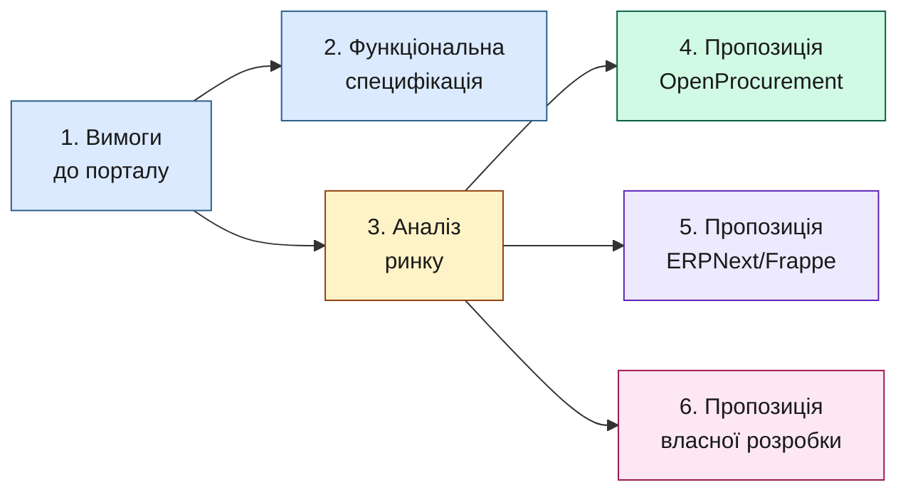
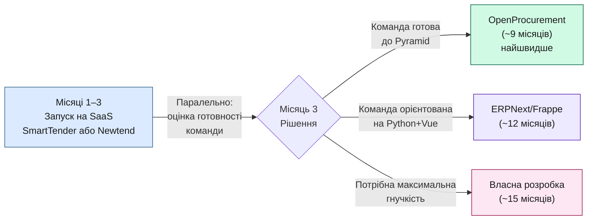

# Огляд проєкту — Портал електронних закупівель Ecooptima

**Версія:** 1.0  
**Дата:** 2026-05-29  
**Призначення:** короткий путівник по всіх документах проєкту з ключовими висновками

---

## 1. Про що цей проєкт

Ecooptima планує впровадити **корпоративний веб-портал електронних закупівель** для прозорого конкурентного придбання обладнання (трансформатори, кабель, сонячні панелі, інвертори, акумуляторні системи тощо) у кількох постачальників.

**Очікувані переваги:**

- Зниження середньої ціни закупівлі на 8–15% за рахунок конкуренції постачальників.
- Скорочення часу на обробку однієї закупівлі з 5–7 днів до 1–2 днів.
- Повна прозорість, аудитованість, фіксація всіх рішень.

---

## 2. Документи проєкту

| # | Документ | Що містить | Кому читати |
|:-:|----------|------------|-------------|
| 1 | **Вимоги до порталу** | Короткі бізнес-вимоги, ролі, обсяг першої версії, обмеження | Керівництво, замовник, всі учасники |
| 2 | **Функціональна специфікація** | Детальний опис як користуватися системою + перелік усіх 21 функціональних вимог | Команда розробки, аналітики, тестувальники |
| 3 | **Аналіз ринку** | Порівняння всіх підходів (SaaS, відкритий код, власна розробка), TCO, рекомендована стратегія | Керівництво, IT-керівники, фінансовий менеджер |
| 4 | **Пропозиція на основі OpenProcurement** | План реалізації на ядрі Prozorro — найшвидше і найменший обсяг робіт | IT-керівник, команда розробки |
| 5 | **Пропозиція на основі ERPNext/Frappe** | План реалізації на ERP-фреймворку Frappe — баланс між готовою інфраструктурою та гнучкістю | IT-керівник, команда розробки |
| 6 | **Пропозиція власної розробки** | План реалізації з нуля на FastAPI + React — максимальна гнучкість | IT-керівник, команда розробки |

---

## 3. Рекомендована послідовність читання

**Для керівництва:** Огляд проєкту → Аналіз ринку (розділ 6 — порівняння підходів) → одна з пропозицій залежно від обраного підходу.

**Для команди розробки:** Вимоги → Функціональна специфікація → пропозиція обраного підходу.

---

## 4. Ключові висновки

### 4.1 Існуючі SaaS-платформи на ринку України

Найпопулярніші — **SmartTender** і **Newtend**. Обидві побудовані на одному й тому самому open-source ядрі **OpenProcurement** (тобто на тому, на чому працює і Prozorro). Це принципово важливо: ми можемо побудувати приватну платформу на тому самому ядрі, без публічності та регуляторних обов'язків держзакупівель.

### 4.2 Три власні підходи (порівняння)

| Показник | OpenProcurement | ERPNext/Frappe | Власна розробка |
|----------|:---------------:|:--------------:|:---------------:|
| **Готова тендерна логіка** | ~90% | ~5% | 0% |
| **Обсяг робіт** | ~1,260 год | ~1,740 год | ~2,200 год |
| **Тривалість (2 розробники)** | **~9 місяців** | ~12 місяців | ~15 місяців |
| **Команда** | 2 внутрішніх розробники | 2 внутрішніх розробники | 2 внутрішніх розробники |
| **Хостинг** | На власних серверах (безкоштовно) | На власних серверах (безкоштовно) | На власних серверах (безкоштовно) |
| **Зовнішні витрати/рік** | ~30,000 грн | ~30,000 грн | ~30,000 грн |
| **Гнучкість UI** | Повна | Обмежена шаблонами Frappe | Максимальна |
| **Ліцензія** | Apache 2.0 | MIT | — |
| **Ризик доступності фахівців** | Середній (вузький стек Pyramid) | Низький (Python + Vue 3) | Низький (FastAPI + React) |

### 4.3 Рекомендована стратегія

**Чому SaaS на старті:** дозволяє провести перші реальні тендери вже через 2–4 тижні, набути досвіду, виявити справжні потреби, дати команді закупівель приклад робочого процесу — без капітальних інвестицій.

**Чому потім перехід на власну платформу:** з власною інфраструктурою (хостинг безкоштовний) та внутрішньою командою власне рішення стає окупним за 3–4 роки порівняно з SaaS, плюс дає повний контроль даних, специфіку енергетичної галузі, інтеграції з внутрішніми системами.

### 4.4 Які підходи відкинуто

| Підхід | Чому |
|--------|------|
| **Prozorro як основна платформа** | Усі тендери публічні за дизайном — не підходить для приватних корпоративних закупівель |
| **Міжнародні Enterprise SaaS** (Jaggaer, Coupa) | Надмірні за функціональністю та вартістю (від $50K/рік); складна адаптація до UA-законодавства |
| **Odoo Community** | Складніша кастомізація ніж Frappe; немає вбудованого аукціону в реальному часі; майже не дешевший за власну розробку |
| **Інші нішеві українські майданчики** | Менша база постачальників або слабкий корпоративний модуль |

---

## 5. Передумови проєкту

| Параметр | Значення |
|----------|----------|
| **Хостинг** | На власних серверах Ecooptima — безкоштовно |
| **Команда** | 2 внутрішніх розробники (full-stack) |
| **Зовнішні витрати** | ~30,000 грн/рік (SSL, поштовий сервіс, API перевірки контрагентів) |
| **Обсяг першої версії** | Реєстрація постачальників, тендери з лотами, закриті пропозиції, зворотній аукціон, оцінка, договори, аналітика, аудит |
| **Поза межами першої версії** | Мобільний застосунок, КЕП/Дія.Підпис, інтеграція з ERP, API для зовнішніх партнерів |

---

## 6. Які рішення потрібно ухвалити

1. **Чи запускати спочатку на SaaS?** Рекомендовано так (3 місяці), щоб отримати швидкий результат і досвід для команди закупівель.
2. **Який стек обрати для власної платформи?** Залежить від готовності внутрішньої команди — див. порівняння в розділі 4.2 цього документа та відповідну пропозицію детальніше.
3. **Чи реалізовувати першу версію в повному обсязі?** Альтернатива — винести зворотній аукціон або мультикритеріальну оцінку у другу фазу, що скоротить строк.
4. **Чи потрібен зовнішній консультант?** Для OpenProcurement-підходу рекомендується короткострокова консультація розробника з досвідом Prozorro-майданчиків на ключових технічних рішеннях.

---

## 7. Наступні кроки

1. Ознайомитись із трьома пропозиціями (OpenProcurement, ERPNext/Frappe, Власна розробка) — короткий розділ «Коли обирати цей підхід» на початку кожної.
2. Оцінити готовність двох внутрішніх розробників щодо різних технологічних стеків.
3. Провести воркшоп із відділом закупівель: підтвердити вимоги та пріоритети, обрати MVP-скоуп.
4. Ухвалити рішення про спочатковий SaaS-пілот (опційно).
5. Ухвалити рішення про підхід до власної платформи.
6. Запустити Фазу 1 обраного підходу.

---

*Цей документ — короткий путівник. Для деталей звертайтесь до відповідних документів проєкту, перелічених у розділі 2.*
