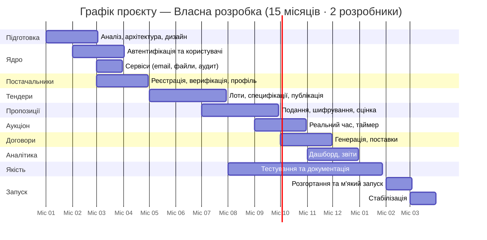

# Пропозиція проєкту — Портал електронних закупівель Ecooptima

**Версія:** 1.0  
**Дата:** 2026-05-28  
**Замовник:** Ecooptima ([ecooptima.com.ua](https://ecooptima.com.ua/))  
**Статус:** На розгляді

---

## 1. Коли обирати цей підхід

Цей документ описує підхід **Власна розробка** — розробку з нуля на FastAPI + React. Повне порівняння всіх підходів — у «Аналіз ринку».

**Обирайте Власна розробка якщо:**

- Потрібна максимальна гнучкість — жодних архітектурних компромісів.
- Є плани монетизувати платформу або відкрити її партнерам по галузі.
- Потрібні глибокі кастомні інтеграції (SCADA, ERP, облікова система).
- Команда готова взяти на себе максимальний обсяг розробки (~2,200 людино-годин).

**Розгляньте альтернативи якщо:**

- Команда має досвід Prozorro-стека → «Пропозиція на основі OpenProcurement» (найшвидше, ~9 місяців, ~43% економії робіт)
- Команда орієнтована на роботу з готовим ERP-фреймворком → «Пропозиція на основі ERPNext/Frappe» (~12 місяців, -20% робіт)
- Потрібен старт за 2–4 тижні → «Аналіз ринку»

> **Ecooptima має власну серверну інфраструктуру** — хостинг безкоштовний для всіх варіантів власної розробки.

---

## 2. Резюме проєкту

Проєкт передбачає розробку корпоративного веб-порталу електронних закупівель для Ecooptima — спеціалізованої платформи для проведення прозорих тендерів на закупівлю обладнання для об'єктів відновлювальної та традиційної електрогенерації.

**Мета:** Знизити витрати на закупівлі через конкуренцію постачальників і автоматизувати процес від публікації тендеру до підписання договору.

**Прогнозований ефект:**

- Зниження середньої ціни закупівлі на 8–15% відносно прямих переговорів.
- Скорочення часу на обробку однієї закупівлі з 5–7 днів до 1–2 днів.
- Повна прозорість і аудитованість кожного рішення.

**Загальна тривалість:** ~14 місяців (перша версія) + 1 місяць стабілізації  
**Команда:** 2 внутрішніх розробники (full-stack)  
**Підхід:** Фіксований обсяг першої версії, потім розвиток у штатному режимі

---

## 2. Обсяг робіт

### Входить у першу версію (Фази 1–7)

- Повний цикл тендеру: створення лоту → публікація → прийом пропозицій → оцінка → визначення переможця
- Реєстрація та верифікація постачальників
- Зворотній аукціон у реальному часі (WebSocket)
- Мультикритеріальна оцінка пропозицій
- Шифрування пропозицій (закрита пропозиція)
- Генерація договорів (DOCX/PDF)
- Email-сповіщення на всіх етапах
- Аналітичний дашборд та звіти (PDF/Excel)
- Управління користувачами та ролями
- Журнал аудиту
- Розгортання у бойовому та тестовому середовищах
- Документація (API, адміністраторська, для постачальників)

### Не входить у першу версію (Фаза 2+)

- Мобільний застосунок (iOS/Android)
- Інтеграція з ERP/1С
- КЕП / Дія.Підпис
- Публічна сторінка прозорості
- API для зовнішніх партнерів

---

## 3. Команда проєкту

Проєкт реалізує внутрішня команда Ecooptima у складі **двох розробників** (full-stack). Кожен розробник виконує як бекенд, так і фронтенд завдання — це необхідно для гнучкості та паралельної роботи над різними модулями.

| Роль | Кількість | Відповідальність |
|------|:---------:|------------------|
| **Розробник #1 (Senior, full-stack)** | 1 | Архітектура, бекенд, ядро бізнес-логіки, інтеграції, DevOps |
| **Розробник #2 (Middle/Senior, full-stack)** | 1 | UI/UX, фронтенд (React), модулі постачальника та аукціону, тестування |

**Зовнішні залучення:** Кваліфікований електронний підпис, перевірка контрагентів через сторонні API — за потреби, на договорі з відповідними сервісами.

**Що не виконує команда:**

- Дизайн UI/UX від професійного дизайнера — використовуються готові UI-бібліотеки та мінімальна кастомізація.
- Виділений QA-інженер — тестування виконується розробниками + UAT з боку команди закупівель Ecooptima.
- Виділений менеджер проєкту — координацію веде Senior-розробник або керівник IT-підрозділу Ecooptima.

---

## 4. Фази проєкту

---

### Фаза 1 — Аналіз і дизайн
**Тривалість:** 1 місяць (Місяць 1)

#### Завдання
- Проведення воркшопу із замовником: збір та фіналізація вимог, пріоритизація першої версії.
- Розробка та погодження ER-діаграми бази даних.
- Вибір та документування технологічного стеку (ADR-документи).
- Вибір хмарного провайдера та конфігурації хостингу.
- UX: wireframes для 10 ключових екранів (погодження із замовником).
- UI: дизайн-система (кольори, типографіка, компоненти) у Figma.
- Макети у Figma для екранів першої версії (hi-fi).
- Написання детального технічного завдання (доповнення до цього документа).
- Налаштування середовища розробки, репозиторіїв, CI/CD pipeline (базовий).

#### Артефакти 
- [ ] Фінальний ER-діаграма БД (погоджений)
- [ ] ADR-документи (технологічний стек)
- [ ] Figma-файл: wireframes + hi-fi макети першої версії
- [ ] Дизайн-система (компонентна бібліотека)
- [ ] Технічне завдання (фінальна версія)
- [ ] Налаштований GitHub репозиторій зі структурою проєкту
- [ ] Базовий CI pipeline (lint, тести запускаються)
- [ ] Тестове та бойове оточення (порожні)

---

### Фаза 2 — Ядро системи та автентифікація
**Тривалість:** 1 місяць (Місяць 2)

#### Завдання
- Ініціалізація проєкту (FastAPI + React + PostgreSQL + Redis).
- Реалізація схеми БД (Alembic-міграції).
- Модуль автентифікації: реєстрація, підтвердження email, вхід, JWT, refresh token, logout.
- 2FA (TOTP): налаштування та верифікація.
- Управління сесіями (Redis).
- Модуль управління користувачами: CRUD, ролі, матриця прав.
- Базова адмін-панель: список користувачів, зміна ролей.
- Фреймворк для email-сповіщень (Celery + шаблони Jinja2).
- Базові тести автентифікації (pytest, покриття >80%).
- Налаштування MinIO для зберігання файлів.

#### Артефакти
- [ ] Робочий модуль автентифікації (login, register, 2FA)
- [ ] Модуль управління користувачами (API + UI)
- [ ] Базова адмін-панель (React)
- [ ] Фреймворк сповіщень (email templates, Celery)
- [ ] Міграції БД (таблиці users, roles, sessions, audit_log)
- [ ] API-документація (Swagger/OpenAPI) для auth-ендпоінтів
- [ ] Покриття тестами: >80% для auth модуля

---

### Фаза 3 — Модуль постачальників
**Тривалість:** 1 місяць (Місяць 3)

#### Завдання
- Реєстраційна форма постачальника (розширена, з завантаженням документів).
- Профіль постачальника: перегляд, редагування, категорії.
- Верифікація постачальника адміністратором (UI + email-сповіщення).
- Реєстр постачальників (адмін): пошук, фільтрація, верифікація, блокування.
- Завантаження документів (MinIO): перевірка типу файлу, антивірус.
- Класифікатор категорій: ієрархічний список, управління (адмін).
- Рейтинг постачальника (модель, авто-розрахунок після завершення договору).
- Інтеграція з YouControl/OpenDataBot для авто-перевірки ЄДРПОУ (базова).
- Тести: реєстрація, верифікація, редагування профілю.

#### Артефакти
- [ ] Форма реєстрації та особистий кабінет постачальника (UI)
- [ ] Адмін-реєстр постачальників (UI + API)
- [ ] Класифікатор категорій (дані + UI управління)
- [ ] Файловий сервіс (MinIO інтеграція + валідація)
- [ ] Email-сповіщення: реєстрація, верифікація, відхилення
- [ ] API-документація для supplier-ендпоінтів
- [ ] Тести: >75% покриття для supplier модуля

---

### Фаза 4 — Модуль тендерів і лотів
**Тривалість:** 1 місяць (Місяць 4)

#### Завдання
- Створення тендеру: форма зі всіма полями, чернетка, публікація.
- Управління лотами: CRUD, технічні параметри (TechParam).
- Стан-машина тендеру (DRAFT→PUBLISHED→BIDDING_OPEN→EVALUATION→AWARDED).
- Публікація тендеру: автоматична розсилка сповіщень по категоріях.
- Запитання та роз'яснення (Q&A): форма питання, відповідь адміна, публікація.
- Завантаження документів до тендеру (специфікації, ТЗ).
- Список тендерів (публічний): фільтрація, пошук, пагінація.
- Детальна сторінка тендеру для постачальника.
- Планувальник: автоматична зміна статусів за дедлайнами (Celery beat).
- Нагадування: email постачальникам за 24 год до дедлайну.

#### Артефакти
- [ ] Форма створення/редагування тендеру + управління лотами (UI)
- [ ] Публічний каталог тендерів з фільтрацією (UI)
- [ ] Детальна сторінка тендеру для постачальника (UI)
- [ ] Q&A модуль (UI + API)
- [ ] Celery beat: авто-зміна статусів тендерів
- [ ] Email: новий тендер, нагадування, уточнення
- [ ] API-документація для tender/lot ендпоінтів
- [ ] Тести: >75% покриття

---

### Фаза 5 — Пропозиції, Аукціон та Оцінка
**Тривалість:** 1 місяць (Місяць 5)

#### Завдання
- Форма подання пропозиції постачальником (ціна, умови, техн. параметри, документи).
- Шифрування пропозицій (AES-256, закрита пропозиція).
- Стан-машина пропозиції.
- Розкриття пропозицій адміністратором.
- Алгоритм оцінки (price-only та weighted-criteria).
- Дискваліфікація пропозиції (з обґрунтуванням).
- Визначення переможця (включаючи двокрокове затвердження, якщо >поріг).
- **Зворотній аукціон (WebSocket):** підключення, ставки в реальному часі, таймер, анонімізація, завершення.
- Email: підтвердження пропозиції, перемога/поразка, дискваліфікація.
- Повідомлення про початок аукціону за 1 годину.

#### Артефакти
- [ ] Форма подання пропозиції (UI) з валідацією техн. параметрів
- [ ] Панель оцінки пропозицій для адміна (UI)
- [ ] Алгоритм оцінки та ранжування (backend)
- [ ] Шифрування/розкриття пропозицій (закрита пропозиція)
- [ ] Аукціонна панель у реальному часі (React + WebSocket)
- [ ] Двокрокове затвердження (адмін + фінансист)
- [ ] Email-сповіщення: перемога, поразка, дискваліфікація
- [ ] Навантажувальний тест аукціону (100 одночасних учасників)
- [ ] Тести: >70% покриття

---

### Фаза 6 — Договори, Аналітика та Звіти
**Тривалість:** 1 місяць (Місяць 6)

#### Завдання
- Генерація договору з шаблону (python-docx → PDF).
- Управління статусами договору, підпис (ручний або КЕП-заглушка).
- Реєстрація поставок, оцінка якості.
- Аналітичний дашборд (React Charts): обсяги, економія, топ постачальники.
- Звіт по тендеру (PDF): усі пропозиції, рейтинг, переможець.
- Зведений звіт за період (Excel/CSV).
- Звіт про економію.
- Звіт по постачальнику.
- Журнал аудиту (UI для Суперадміна).
- Налаштування системи (UI): пороги, шаблони email, шаблон договору.

#### Артефакти
- [ ] Генерація та управління договорами (UI + API)
- [ ] Реєстрація поставок та оцінка якості (UI)
- [ ] Аналітичний дашборд (4 типи графіків)
- [ ] Генератор звітів: 4 типи (PDF + Excel)
- [ ] Журнал аудиту (UI)
- [ ] Панель налаштувань системи (UI)
- [ ] API-документація (повна, Swagger)

---

### Фаза 7 — Тестування, безпека та запуск
**Тривалість:** 1 місяць (Місяць 7)

#### Завдання
- Функціональне тестування (QA): всі User Stories, регресія.
- Автоматизовані E2E тести (Playwright): 20 ключових сценаріїв.
- Навантажувальне тестування (Locust): 500 одночасних користувачів.
- Тестування безпеки (OWASP Top 10, penetration test базовий).
- Виправлення всіх знайдених критичних та високих дефектів.
- Повний стрес-тест аукціону.
- Документація: API (OpenAPI), адміністраторська інструкція (UA), інструкція постачальника (UA).
- Відео-туторіали: 3–5 коротких відео для постачальників.
- Налаштування бойового середовища: моніторинг (Grafana+Prometheus), алерти.
- Резервне копіювання (автоматичне, щодня).
- Навчання команди Ecooptima (2–3 дні).
- М'який запуск із 5–10 реальними постачальниками.

#### Артефакти
- [ ] QA-звіт: тест-план, результати, список дефектів
- [ ] E2E тести (Playwright, 20 сценаріїв)
- [ ] Звіт навантажувального тестування
- [ ] Базовий звіт тестування безпеки
- [ ] Документація: API + адмін + постачальник (UA)
- [ ] Налаштований моніторинг (Grafana дашборд)
- [ ] Розгортання у бойове середовище (стабільне)
- [ ] Акт здачі-приймання першої версії

---

### Фаза 8 — Стабілізація та підтримка
**Тривалість:** 1 місяць (Місяць 8)

#### Завдання
- Гарантійна підтримка після запуску.
- Виправлення багів, що виявлені у бойовому середовищі.
- Збір зворотного зв'язку від перших реальних тендерів.
- Пріоритизація Фази 2 (бекілог).
- SLA моніторинг.

#### Артефакти
- [ ] Щотижневі звіти про стан бойового середовища
- [ ] Список пріоритетів для Фази 2 (погоджений із замовником)
- [ ] SLA-звіт за місяць

---

## 5. Зведений графік та дорожня карта

### Ключові дати (відносно старту)

| Місяць | Подія |
|--------|-------|
| М2 | Затверджений ER-проєкт, базова автентифікація |
| М4 | Реєстр постачальників готовий |
| М7 | Перший тестовий тендер у тестовому середовищі |
| М10 | Зворотній аукціон протестований |
| М12 | Договори та аналітика готові |
| М13 | Повна перша версія у тестовому середовищі |
| М14 | М'який запуск у бойовому середовищі |
| М15 | Стабільне бойове середовище, акт підписано |

---

## 6. Оцінка трудовитрат

### 6.1 Загальні трудовитрати

| Метрика | Значення |
|---------|:--------:|
| Загальний обсяг робіт | ~2,200 людино-годин |
| Розробники | 2 (full-stack) |
| Ефективні людино-години / місяць (1 розробник) | ~140 |
| Сумарна потужність команди / місяць | ~280 людино-годин |
| Тривалість першої версії | ~14 місяців (за умови повної зайнятості обох розробників) |
| Тривалість стабілізації | ~1 місяць |
| **Разом** | **~15 місяців** |

> **Як прискорити:** скоротити обсяг першої версії (винести зворотній аукціон, мультикритеріальну оцінку або генерацію договорів у Фазу 2) або залучити третього розробника на пікові фази.

### 6.2 Розподіл трудовитрат по модулях

| Модуль | Орієнт. трудовитрати |
|--------|:--------------------:|
| Аналіз, архітектура, налаштування середовища | ~120 год |
| Автентифікація, ролі, управління користувачами | ~180 год |
| Модуль постачальників (реєстрація, верифікація, профіль) | ~200 год |
| Модуль тендерів і лотів (CRUD, стан-машина, публікація) | ~240 год |
| Модуль пропозицій (форма, шифрування, розкриття) | ~220 год |
| Модуль аукціону (WebSocket, реальний час, таймер) | ~200 год |
| Модуль оцінки та визначення переможця | ~140 год |
| Модуль договорів і поставок | ~140 год |
| Аналітика, дашборд, звіти | ~180 год |
| Адміністрування системи та налаштування | ~120 год |
| Email-сервіс та сповіщення | ~80 год |
| Безпека, аудит, відповідність | ~100 год |
| Тестування (юніт, інтеграційне, E2E) | ~280 год |
| Документація (адмін, постачальник, технічна) | ~120 год |
| **Разом** | **~2,320 год** |

---

## 7. Хостинг

Ecooptima розгортає систему на **власних серверах** із залученням внутрішньої команди супроводу. **Хостинг та обслуговування серверів — безкоштовні** в межах цього проєкту.

**Що потрібно від Ecooptima на старті:**

- Виділені серверні ресурси (орієнтовно: 2 сервери для бойового середовища, 1 для тестового).
- Обліковий запис для команди розробки на час впровадження.
- Канал доступу до серверів (VPN або bastion-host).
- Резервне копіювання за внутрішнім регламентом компанії.

---

## 8. Зовнішні витрати проєкту

Оскільки розробка ведеться внутрішньою командою Ecooptima на власній інфраструктурі, зовнішні грошові витрати обмежені переліком ліцензій та сторонніх сервісів.

| Стаття | Орієнт. вартість |
|--------|:----------------:|
| SSL-сертифікат | ~5,000 грн/рік |
| Поштовий сервіс (наприклад, SendGrid) | ~10,000 грн/рік |
| API перевірки контрагентів (YouControl або аналог) | ~15,000 грн/рік |
| Хостинг | 0 (власні сервери Ecooptima) |
| **Разом / рік** | **~30,000 грн** |

> **Що не входить:** оплата праці внутрішніх розробників (виплачується через стандартний фонд оплати праці Ecooptima, не є проєктною витратою).

---

## 9. Критерії приймання (Definition of Done)

### Перша версія готова, якщо:
- [ ] Всі Must Have вимоги з «Вимоги до порталу» реалізовані та протестовані.
- [ ] E2E тести (20 сценаріїв) виконуються без помилок.
- [ ] Навантажувальний тест: 500 одночасних користувачів — час відповіді <2 сек.
- [ ] Аукціон: 100 одночасних учасників, затримка ставки <1 сек.
- [ ] Нуль критичних та нуль високих невиправлених дефектів безпеки.
- [ ] API задокументований (OpenAPI/Swagger).
- [ ] Адміністраторська інструкція готова (UA, >20 сторінок).
- [ ] Інструкція постачальника готова (UA, >15 сторінок).
- [ ] Проведено перший реальний тендер у бойовому середовищі.
- [ ] Підписаний акт здачі-приймання.

---

## 10. Ризики та мітигація

| Ризик | Вірогідність | Вплив | Мітигація |
|-------|:------------:|:-----:|-----------|
| Зміна вимог у ході розробки | Висока | Середній | Фіксований обсяг першої версії; процедура зміни вимог |
| Затримка з наймом команди | Середня | Високий | Почати підбір до підписання контракту |
| Проблеми з аукціоном в реальному часі | Середня | Середній | Прототип в Фазі 2 (proof of concept) |
| Відмова хостинг-провайдера (GigaCloud) | Низька | Середній | Резервний бекап в AWS S3 |
| Постачальники відмовляються реєструватись | Середня | Високий | Персональне залучення топ-20 постачальників |
| Складність інтеграції КЕП | Середня | Низький | КЕП відкладений до Фази 2 |
| Кібератаки / DDoS | Низька | Високий | Cloudflare, rate limiting, WAF |

---

## 11. Умови та наступні кроки

### Щоб розпочати Фазу 1, необхідно:
1. Підписати договір на розробку.
2. Оплатити аванс (30% від вартості Фази 1).
3. Призначити Product Owner з боку Ecooptima (1 контактна особа для погодження).
4. Надати доступи: домен, облікові дані хостингу (або обрати провайдера).
5. Організувати kick-off воркшоп (2–4 год) із залученням усіх зацікавлених сторін.

### Пропонована схема оплати:
| Подія | % від суми |
|-------|:----------:|
| Підписання договору (аванс) | 20% |
| Завершення Фази 2 (Auth готовий) | 15% |
| Завершення Фази 4 (Тендери готові) | 20% |
| Завершення Фази 6 (Повна перша версія у тестовому середовищі) | 25% |
| Підписання акту першої версії (Фаза 7) | 15% |
| Завершення Фази 8 (Стабілізація) | 5% |

---

*Пропозиція дійсна 30 днів від дати виставлення. Вартість підлягає коригуванню після проведення discovery-сесії та уточнення обсягу.*
