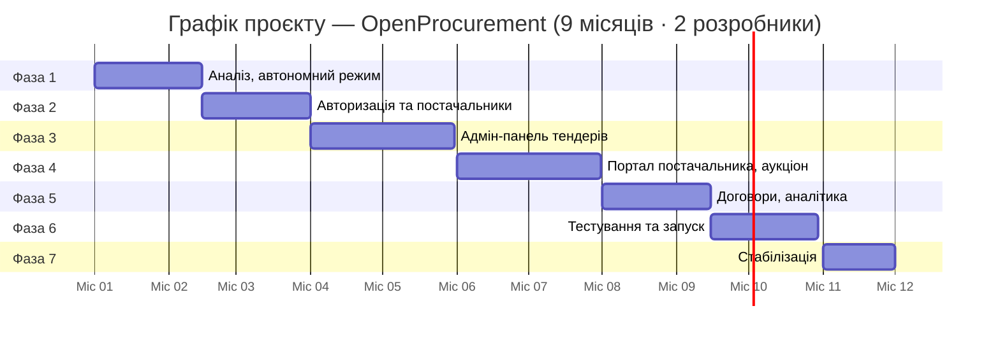

# Пропозиція проєкту — Підхід на основі OpenProcurement

**Версія:** 1.0  
**Дата:** 2026-05-29  
**Замовник:** Ecooptima ([ecooptima.com.ua](https://ecooptima.com.ua/))  
**Статус:** На розгляді  
**Пов'язані документи:** «Функціональна специфікація» · «Аналіз ринку» · «Пропозиція власної розробки» · «Пропозиція на основі ERPNext/Frappe»

---

## 1. Коли обирати цей підхід

Цей документ описує підхід **адаптації OpenProcurement** — ядра платформи Prozorro — для потреб Ecooptima. Повне порівняння всіх підходів — у «Аналіз ринку».

**Обирайте OpenProcurement якщо:**

- Команда має досвід Python/Pyramid (стек OpenProcurement) або готова пройти онбординг на кодову базу.
- Потрібен найшвидший запуск першої версії (~9 місяців замість ~12–15).
- Важлива відповідність до принципів Prozorro (прозорий аукціон, закрита пропозиція, мультикритеріальна оцінка — вже реалізовані).
- Є можливість залучити короткострокову консультацію від OpenProcurement-експерта на ключових етапах.

**Розгляньте альтернативи якщо:**

- Команда не готова до Python/Pyramid → «Пропозиція на основі ERPNext/Frappe» (ширший стек, ~12 місяців).
- Потрібна максимальна гнучкість або ERP-інтеграція → «Пропозиція власної розробки» (~15 місяців).
- Потрібен старт за 2–4 тижні → «Аналіз ринку».

> **Ecooptima має власну серверну інфраструктуру** — хостинг безкоштовний.

---

## 2. Суть підходу

OpenProcurement — це відкрите ядро (Python/Pyramid), на якому побудована вся платформа Prozorro, а також провідні українські комерційні майданчики:

| Комерційний продукт | Заснований на OpenProcurement |
|---------------------|:---:|
| Prozorro (держзакупівлі) | ✅ |
| SmartTender | ✅ |
| Newtend | ✅ |
| Zakupki.prom.ua | ✅ |

Це означає: SmartTender і Newtend, якими ми розглядали скористатися як SaaS, самі побудовані на тому самому ядрі. Ecooptima може побудувати аналогічну приватну платформу, адаптувавши OpenProcurement під власні потреби, — без публічності та регуляторних обов'язків держзакупівель.

**~90% тендерної доменної логіки вже реалізовано.** Команда пише лише те, чого не вистачає: інтерфейс, систему авторизації та відключення від центральної бази Prozorro.

---

## 3. Що OpenProcurement дає готовим

| Компонент | Статус |
|-----------|:------:|
| Тендерна стан-машина (Чернетка → Активний → … → Завершений) | ✅ |
| Управління лотами та технічними специфікаціями | ✅ |
| Подання пропозицій із закритими цінами до дедлайну | ✅ |
| Розкриття пропозицій після дедлайну | ✅ |
| Зворотній аукціон у реальному часі | ✅ |
| Мультикритеріальна оцінка пропозицій | ✅ |
| Q&A (запитання та роз'яснення до тендеру) | ✅ |
| Журнал аудиту (незмінний) | ✅ |
| REST API (OpenAPI) | ✅ |
| Email-сповіщення | ✅ |
| Управління постачальниками | ⚠️ Часткове |
| Адмін-панель та портал постачальника (UI) | ❌ Потрібно розробити |
| Авторизація, ролі, 2FA | ⚠️ Базова, потребує розширення |
| Приватний режим (без Prozorro central DB) | ⚠️ Потребує налаштування |

---

## 4. Що потрібно розробити

| Компонент | Обсяг (год) |
|-----------|:-----------:|
| Відключення від центральної бази Prozorro, standalone-режим | ~80 |
| Міграція CouchDB → PostgreSQL (за бажанням) | ~160 |
| Розширення авторизації: 2FA, ролі, управління сесіями | ~120 |
| Адмін-панель: тендери, лоти, постачальники, звіти | ~240 |
| Портал постачальника: реєстрація, профіль, подання пропозиції | ~200 |
| Email-сервіс: шаблони сповіщень, черга | ~60 |
| Генерація договорів (PDF з шаблону) | ~40 |
| Аналітичний дашборд та звіти (Excel/PDF) | ~120 |
| QA, DevOps, документація | ~240 |
| **Разом** | **~1,260 год** |

> Порівняно з ~2,200 год для власної розробки — **економія ~43%** (~940 год, ~1.6 млн грн).

### 4.1 Рішення щодо CouchDB

OpenProcurement побудований на CouchDB. Є два варіанти:

**Варіант A: Залишити CouchDB** (~0 год додаткових робіт)

- Перевага: не потрібна міграція, система запускається швидше.
- Ризик: вузький ринок CouchDB-адміністраторів, складніші аналітичні запити.
- Рекомендується якщо: команда вже має CouchDB-досвід.

**Варіант B: Мігрувати на PostgreSQL** (~160 год)

- Перевага: стандартна БД, ширший ринок фахівців, зручніша аналітика.
- Ризик: додаткові витрати часу, потенційні несумісності.
- Рекомендується для Ecooptima як довгострокове рішення.

---

## 5. Порівняння з іншими підходами

| Критерій | OpenProcurement | ERPNext/Frappe | Власна розробка |
|----------|:---------------:|:--------------:|:---------------:|
| **Вартість розробки** | **~2.8 млн грн** | ~3.5 млн грн | ~4.4 млн грн |
| **Час до першої версії** | **5–6 місяців** | 8 місяців | 8 місяців |
| **Тендерна логіка з коробки** | **~90%** | ~5% | 0% |
| **Хостинг (Ecooptima)** | 0 грн | 0 грн | 0 грн |
| **TCO 5 років** | **~3.8 млн грн** | ~4.7 млн грн | ~6.0 млн грн |
| **Доступність розробників** | Вузька (~50–100) | Широка | Дуже широка |
| **Ліцензія** | Apache 2.0 | MIT | — |
| **PostgreSQL** | Після міграції | З v15 | Так |
| **Гнучкість UI** | Повна (пишемо з нуля) | Обмежена Frappe | Повна |

---

## 6. Команда проєкту

Проєкт реалізує внутрішня команда Ecooptima у складі **двох розробників** (full-stack). Кожен бере на себе як бекенд-завдання (Python адаптація OpenProcurement), так і фронтенд-завдання (React адмін-панель та портал постачальника).

| Роль | Кількість | Відповідальність |
|------|:---------:|------------------|
| **Розробник #1 (Senior, full-stack)** | 1 | Адаптація ядра OpenProcurement, відключення центральної бази Prozorro, міграція БД, авторизація |
| **Розробник #2 (Middle/Senior, full-stack)** | 1 | Адмін-панель (React), портал постачальника, email-сервіс, звіти, тестування |

**Ключова вимога до команди:** хоча б один із розробників має досвід Python + Pyramid (стек OpenProcurement) або готовий пройти 2–4 тижні онбордингу на кодову базу. Альтернативно — короткострокова консультація від розробника з досвідом Prozorro-майданчиків (SmartTender, Newtend, Zakupki.prom.ua) на ключових етапах адаптації ядра.

**Що не виконує команда:**

- Дизайн UI/UX — використовуються готові React-бібліотеки.
- Виділений QA — тестування виконується розробниками + UAT з боку команди закупівель Ecooptima.
- Виділений менеджер проєкту — координацію веде Senior-розробник.

---

## 7. Фази проєкту

---

### Фаза 1 — Аналіз, налаштування, автономний режим
**Тривалість:** 1 місяць (Місяць 1)

#### Завдання
- Глибокий аналіз коду OpenProcurement: які компоненти використовуємо, що відключаємо, що дописуємо.
- Відключення інтеграції з центральною базою Prozorro — запуск у автономному (standalone) режимі.
- Відключення або адаптація обов'язкових державних процедур (строки публікацій, АМКУ, обов'язкові поля держзакупівель).
- Рішення щодо CouchDB vs PostgreSQL.
- Розгортання OpenProcurement у тестовому середовищі.
- Gap-аналіз: таблиця «що є / що треба дописати».
- UX/UI дизайн: wireframes адмін-панелі та порталу постачальника у Figma.
- Налаштування репозиторію, CI/CD.

#### Артефакти
- [ ] Задокументований gap-аналіз
- [ ] Автономний екземпляр OpenProcurement у тестовому середовищі
- [ ] Figma: wireframes + hi-fi макети
- [ ] Рішення щодо CouchDB/PostgreSQL зафіксоване
- [ ] CI/CD pipeline налаштований

---

### Фаза 2 — Авторизація, ролі, управління постачальниками
**Тривалість:** 1 місяць (Місяць 2)

#### Завдання
- Розширення системи авторизації: 2FA, управління сесіями, httpOnly cookies.
- Матриця ролей: Суперадміністратор, Адміністратор закупівель, Технічний експерт, Фінансовий менеджер, Спостерігач, Постачальник.
- Публічна форма реєстрації постачальника (назва, ЄДРПОУ, реквізити, документи).
- Верифікація постачальника адміністратором.
- Завантаження та зберігання документів постачальника.
- Класифікатор категорій обладнання (ієрархічний).
- Рейтинг постачальника (модель + авто-розрахунок).
- Email-сервіс: шаблони сповіщень, черга.

#### Артефакти
- [ ] Модуль авторизації та ролей
- [ ] Реєстрація та верифікація постачальника (UI + логіка)
- [ ] Класифікатор категорій
- [ ] Email-сервіс (усі шаблони)
- [ ] Тести: >75% покриття

---

### Фаза 3 — Адмін-панель: тендери та лоти
**Тривалість:** 1 місяць (Місяць 3)

#### Завдання
- Адмін-панель для управління тендерами (форма створення, список, фільтрація, статуси).
- Управління лотами: CRUD, технічні параметри, прикріплення файлів.
- Публікація тендеру з автоматичним розсиланням сповіщень за категоріями.
- Q&A модуль: форма запитання, відповідь адміна, публікація.
- Автоматична зміна статусів тендеру за дедлайнами (планувальник).
- Нагадування постачальникам за 24 год до дедлайну.
- Публічний каталог тендерів для постачальника (список + деталі).

#### Артефакти
- [ ] Адмін-панель: тендери та лоти (UI + API)
- [ ] Публічний каталог тендерів (UI)
- [ ] Q&A модуль
- [ ] Планувальник статусів

---

### Фаза 4 — Портал постачальника: пропозиції та аукціон
**Тривалість:** 1 місяць (Місяць 4)

#### Завдання
- Форма подання пропозиції: ціна, терміни, гарантія, технічні параметри, документи.
- Валідація технічних параметрів при поданні.
- Підтвердження подачі поштою.
- Розкриття пропозицій адміністратором (публічне / закрите).
- Адаптація вбудованого аукціонного модуля OpenProcurement до UI.
- Аукціонна панель у реальному часі: ставки, таймер, анонімізація учасників.
- Алгоритм оцінки: тільки ціна та зважені критерії.
- Дискваліфікація пропозицій.
- Двокрокове затвердження переможця (адмін + фінансист понад поріг).
- Email: перемога, поразка, дискваліфікація.

#### Артефакти
- [ ] Форма подання пропозиції (UI)
- [ ] Аукціонна панель (UI — адаптація вбудованого аукціону OpenProcurement)
- [ ] Панель оцінки для адміна
- [ ] Двокрокове затвердження
- [ ] Навантажувальний тест аукціону (100 учасників)

---

### Фаза 5 — Договори, аналітика, звіти та міграція БД
**Тривалість:** 1 місяць (Місяць 5)

#### Завдання
- Генерація договору з шаблону (DOCX → PDF).
- Реєстрація поставок та оцінка якості.
- Аналітичний дашборд (обсяг закупівель, економія, топ постачальники).
- Звіти: по тендеру, по постачальнику, зведений, про економію (PDF + Excel).
- Журнал аудиту (UI для Суперадміністратора).
- Якщо обрано Варіант B: міграція CouchDB → PostgreSQL.
- Налаштування системи (параметри аукціону, поріг, шаблони, брендинг).
- Оскарження результатів (форма скарги, відповідь адміна).

#### Артефакти
- [ ] Генерація договорів (PDF)
- [ ] 4 типи звітів (PDF + Excel)
- [ ] Аналітичний дашборд
- [ ] Журнал аудиту (UI)
- [ ] Міграція БД (якщо обрано Варіант B)
- [ ] Модуль оскарження

---

### Фаза 6 — Тестування, безпека та запуск
**Тривалість:** 1 місяць (Місяць 6)

#### Завдання
- Функціональне тестування (QA): всі User Stories.
- Автоматизовані E2E-тести (Playwright): 15 ключових сценаріїв.
- Навантажувальне тестування (Locust): 500 одночасних користувачів.
- Тестування безпеки (типові веб-вразливості).
- Виправлення всіх критичних та високих дефектів.
- Документація: адміністраторська інструкція (UA), інструкція постачальника (UA).
- Розгортання у бойове середовище на власних серверах Ecooptima (nginx + supervisor).
- Моніторинг (Grafana + Prometheus).
- Навчання команди Ecooptima (1–2 дні).
- М'який запуск з 5–10 реальними постачальниками.

#### Артефакти
- [ ] QA-звіт
- [ ] E2E-тести (15 сценаріїв)
- [ ] Звіт навантажувального тестування
- [ ] Документація (адмін + постачальник, UA)
- [ ] Бойове середовище на серверах Ecooptima
- [ ] Акт здачі-приймання першої версії

---

### Фаза 7 — Стабілізація та підтримка
**Тривалість:** 1 місяць (Місяць 7)

Гарантійна підтримка після запуску, виправлення виявлених багів у бойовому середовищі, збір зворотного зв'язку від перших реальних тендерів, план другої фази розвитку.

#### Артефакти
- [ ] Щотижневі звіти про стан бойового середовища
- [ ] Список пріоритетів для Фази 2 (погоджений із замовником)

---

## 8. Зведений графік

### Ключові дати (відносно старту)

| Місяць | Подія |
|--------|-------|
| М1.5 | Автономний OpenProcurement у тестовому середовищі |
| М3 | Реєстр постачальників готовий |
| М5 | Перший тестовий тендер в адмін-панелі |
| М7 | Перша тестова пропозиція та аукціон |
| М8.5 | Договори, аналітика готові |
| М10 | Повна перша версія у тестовому середовищі |
| М10.5 | М'який запуск (бойове середовище) |
| М11 | Стабільне бойове середовище, акт підписано |

---

## 9. Оцінка трудовитрат

### 9.1 Загальні трудовитрати

| Метрика | Значення |
|---------|:--------:|
| Загальний обсяг робіт | ~1,260 людино-годин |
| Економія порівняно з власною розробкою | ~940 годин (-43%) |
| Розробники | 2 (full-stack) |
| Ефективні людино-години / місяць (1 розробник) | ~140 |
| Сумарна потужність команди / місяць | ~280 людино-годин |
| Тривалість першої версії | ~8 місяців |
| Тривалість стабілізації | ~1 місяць |
| **Разом** | **~9 місяців** |

> **Чому найшвидше:** ~90% тендерної доменної логіки вже реалізовано в OpenProcurement. Команда фокусується лише на адаптації, інтерфейсі та інтеграції з внутрішнім контуром Ecooptima.

### 9.2 Розподіл трудовитрат

| Завдання | Орієнт. трудовитрати |
|----------|:--------------------:|
| Аналіз кодової бази OpenProcurement, налаштування | ~120 год |
| Відключення центральної бази Prozorro, standalone-режим | ~80 год |
| Міграція CouchDB → PostgreSQL (опціонально) | ~160 год |
| Розширення авторизації: 2FA, ролі, сесії | ~120 год |
| Адмін-панель (React): тендери, лоти, постачальники, звіти | ~240 год |
| Портал постачальника (React): реєстрація, профіль, пропозиція | ~200 год |
| Email-сервіс: шаблони, черга | ~60 год |
| Генерація договорів (PDF) | ~40 год |
| Аналітичний дашборд та звіти | ~120 год |
| Тестування | ~200 год |
| Документація | ~120 год |
| **Разом** | **~1,460 год** |

### 9.3 Порівняння підходів за обсягом робіт

| | OpenProcurement | ERPNext/Frappe | Власна розробка |
|-|:---------------:|:--------------:|:---------------:|
| Обсяг робіт | **~1,260 год** | ~1,740 год | ~2,200 год |
| Економія vs власна розробка | **-43%** | -20% | — |
| Тривалість (2 розробники) | **~9 місяців** | ~12 місяців | ~15 місяців |
| Хостинг (Ecooptima) | 0 грн | 0 грн | 0 грн |

---

## 10. Хостинг

Ecooptima розгортає систему на **власних серверах** із залученням внутрішньої команди супроводу. **Хостинг та обслуговування серверів — безкоштовні** в межах цього проєкту.

**Що потрібно від Ecooptima на старті:**

- Виділені серверні ресурси (типово: 2 сервери для бойового середовища, 1 для тестового).
- Канал доступу до серверів для команди розробки.
- Резервне копіювання за внутрішнім регламентом компанії.

---

## 11. Ризики

| Ризик | Вірогідність | Вплив | Мітигація |
|-------|:------------:|:-----:|-----------|
| Внутрішня команда не має досвіду Pyramid/CouchDB | Висока | Критичний | 2–4 тижні онбордингу у Фазі 1; короткострокова консультація OpenProcurement-експерта |
| CouchDB-складності при аналітичних запитах | Середня | Середній | Обрати PostgreSQL-міграцію у Фазі 1 |
| Неповне відключення регуляторної логіки | Середня | Середній | Gap-аналіз у Фазі 1; перевірка юристом |
| Мажорне оновлення OpenProcurement ламає адаптацію | Низька | Середній | Зафіксувати версію; оновлювати лише заплановано |
| Перенавантаження команди (2 людини на 1,260 год) | Середня | Середній | Реалістичний скоуп; винесення низькопріоритетних модулів у фазу 2 |
| Постачальники відмовляються реєструватись | Середня | Середній | Особисте залучення топ-20 постачальників |

---

## 12. Наступні кроки

1. **Оцінка готовності команди:** оцінити досвід двох внутрішніх розробників щодо Python/Pyramid; визначити обсяг онбордингу.
2. **Discovery-сесія (1 тиждень):** внутрішня команда проводить gap-аналіз кодової бази OpenProcurement; уточнюється обсяг і строки.
3. **Опційно — консультант:** за потреби залучити короткострокову консультацію розробника з досвідом Prozorro-майданчиків (SmartTender, Newtend, Zakupki) на ключових технічних рішеннях (відключення central DB, міграція CouchDB).
4. **Ухвалити рішення:** OpenProcurement, Frappe або власна розробка — залежно від готовності команди.
5. **Розпочати Фазу 1.**

---

*Пропозиція дійсна 30 днів. Вартість коригується після gap-аналізу у Фазі 1 та отримання пропозицій від команд.*
