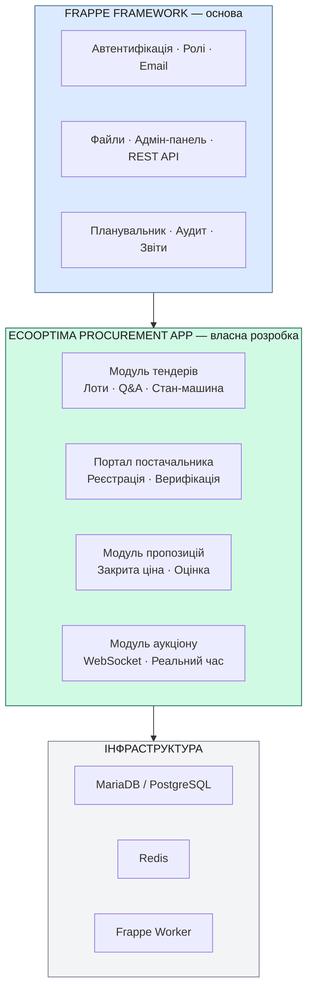
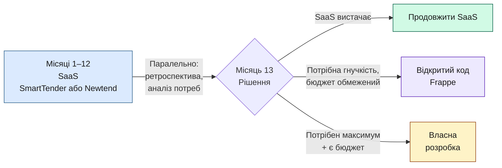

# Пропозиція проєкту — Підхід з відкритим кодом (ERPNext / Frappe)

**Версія:** 1.0  
**Дата:** 2026-05-29  
**Замовник:** Ecooptima ([ecooptima.com.ua](https://ecooptima.com.ua/))  
**Статус:** На розгляді  
**Пов'язані документи:** «Функціональна специфікація» · «Пропозиція на основі OpenProcurement» · «Пропозиція власної розробки» · «Аналіз ринку»

---

## 1. Коли обирати цей підхід

Цей документ описує підхід **ERPNext/Frappe** — адаптація загального ERP-фреймворку з відкритим кодом. Повне порівняння всіх підходів — у «Аналіз ринку».

**Обирайте ERPNext/Frappe якщо:**

- Команда орієнтована на роботу з готовим ERP-фреймворком (Python + Vue 3).
- Розглядаєте розширення до повноцінної ERP у майбутньому.
- Потрібна MIT-ліцензія без юридичних обмежень.
- Прийнятний компроміс: економія часу (~20%) за рахунок певних обмежень UI.

**Розгляньте альтернативи якщо:**

- Команда має досвід Prozorro-стека → «Пропозиція на основі OpenProcurement» (~9 міс, ~90% тендерної логіки готово)
- Потрібна максимальна гнучкість UI та архітектури → «Пропозиція власної розробки» (~15 міс)
- Потрібен старт за 2–4 тижні → «Аналіз ринку»

> **Ecooptima має власну серверну інфраструктуру** — хостинг безкоштовний.

---

## 2. Суть підходу

Замість розробки з нуля або оренди SaaS — взяти зрілий відкритий код фреймворк і написати поверх нього спеціалізовані модулі тендерної платформи.

**Обраний фреймворк:** [ERPNext / Frappe Framework](https://frappeframework.com)  
**Альтернатива:** [Odoo Community Edition](https://odoo.com)

> **Примітка щодо хостингу:** Ecooptima має власну серверну інфраструктуру та команду супроводу. Хостинг та обслуговування серверів — **безкоштовні**, що суттєво покращує TCO порівняно з хмарними варіантами.

---

## 2. Порівняння відкритий код фреймворків та обґрунтування вибору

Перед тим як рекомендувати ERPNext/Frappe, було розглянуто чотири кандидати. Детальне порівняння — також у розділі 7 «Аналіз ринку».

### 2.1 Кандидати та зв'язок з комерційними продуктами

| Платформа | Ліцензія | Комерційні продукти на її основі |
|-----------------------|:--------:|----------------------------------|
| **OpenProcurement** | Apache 2.0 | Prozorro, **SmartTender**, **Newtend**, Zakupki.prom.ua — весь ринок UA тендерів |
| **ERPNext / Frappe** | MIT | Frappe Cloud (managed hosting), Frappe Enterprise (підтримка) |
| **Odoo Community** | LGPL v3 | Odoo Enterprise (платні модулі), сотні Odoo-партнерів |
| **Власна розробка FastAPI/Django** | — | — (базова лінія порівняння) |

### 2.2 Порівняльна таблиця

| Критерій | OpenProcurement | ERPNext/Frappe | Odoo 17 | Custom |
|----------|:---------------:|:--------------:|:-------:|:------:|
| **Тендерна логіка з коробки** | ✅ ~90% | ❌ ~5% | ⚠️ ~15% | ❌ 0% |
| **Інфраструктура** (auth, email, файли, аудит) | ⚠️ Базова | ✅ Повна | ✅ Повна | ❌ З нуля |
| **Вартість розробки** | ~2.8 млн | ~3.5 млн | ~3.8 млн | ~4.4 млн |
| **Час до першої версії** | 5–6 міс | 8 міс | 8 міс | 8 міс |
| **Доступність розробників (UA)** | Вузька (~50–100) | Широка | Середня | Дуже широка |
| **База даних** | CouchDB ⚠️ | MariaDB/PG ✅ | PostgreSQL ✅ | PostgreSQL ✅ |
| **Гнучкість кастомізації** | Середня | Висока | Середня | Максимальна |
| **Ліцензія** | Apache 2.0 ✅ | MIT ✅ | LGPL ⚠️ | — |
| **Деплой на власних серверах** | Середній | Середній (bench) | Складніший | Простий |

### 2.3 Чому не OpenProcurement (незважаючи на кращу тендерну логіку)

OpenProcurement є **найсильнішим кандидатом за доменною логікою** — ~90% тендерної функціональності вже реалізовано, і саме на ньому побудовані SmartTender і Newtend. Однак для цієї пропозиції він не обраний з таких причин:

- **CouchDB** — нестандартна база даних, міграція на PostgreSQL коштує ~160 год.
- **Pyramid** — менш поширений веб-фреймворк; ринок фахівців вузький (~50–100 в Україні), що ускладнює та здорожує набір команди.
- **Регуляторне зв'язування** — відключення обов'язкових державних процедур потребує глибокого розуміння коду.
- **Публічність за дизайном** — відключення центральної Prozorro-бази потребує архітектурних змін.

> **Якщо Ecooptima знайде команду з досвідом OpenProcurement** — варто переглянути рішення на його користь: вартість розробки ~2.8 млн грн (-20% від Frappe) і строк 5–6 місяців замість 8.

### 2.4 Чому не Odoo

- Складніша кастомізація (OWL frontend, жорстка архітектура).
- LGPL — юридичні обмеження при модифікації ядра.
- Вартість майже не відрізняється від власна розробка (~3.8 млн).
- Немає вбудованого realtime для аукціону.

### 2.5 Чому ERPNext / Frappe

- **MIT-ліцензія** — жодних обмежень.
- **Широкий ринок розробників** — будь-який Python/Vue-розробник може онбординутись за 1–2 тижні.
- **Frappe Realtime (Socket.IO вбудований)** — спрощує реалізацію аукціону.
- **Повна інфраструктура з коробки** — auth, ролі, email, файли, аудит, звіти, API.
- **Frappe App** — чистий механізм розширення без злому ядра; оновлення фреймворку не ламають кастомний код.
- **PostgreSQL підтримка** (з v15) — наш стандарт БД.

---

---

## 2. Чому ERPNext (Frappe Framework)

### 2.1 Що таке Frappe

Frappe — це Python/JavaScript веб-фреймворк з вбудованою ORM, REST API, системою користувачів, подієвою шиною та конструктором форм і звітів. ERPNext — ERP-система, побудована на Frappe; але сам Frappe можна використовувати окремо, пишучи власні застосунки (apps) поверх нього.

**Репозиторій:** github.com/frappe/frappe  
**Ліцензія:** MIT (повністю безкоштовна, включаючи комерційне використання)  
**Технологічний стек:** Python 3.12, JavaScript (Vue 3 для frontend), MariaDB/PostgreSQL, Redis, Node.js (збірка)

### 2.2 Що Frappe дає «з коробки»

| Компонент | Статус | Релевантність для Ecooptima |
|-----------|--------|----------------------------|
| Автентифікація (login, 2FA, OAuth) | ✅ Вбудовано | Повністю покриває NFR-04 |
| Управління ролями та правами | ✅ Вбудовано | Матриця ролей з functional-spec |
| Email-сповіщення (шаблони, черга) | ✅ Вбудовано | Всі notification-шаблони |
| Завантаження та зберігання файлів | ✅ Вбудовано | Документи постачальників, тендерів |
| REST API (авто-генерація) | ✅ Вбудовано | API для інтеграцій |
| Адмін-панель (CRUD для DocTypes) | ✅ Вбудовано | Управління тендерами, постачальниками |
| Конструктор звітів | ✅ Вбудовано | FR-16, FR-17 (аналітика) |
| Журнал аудиту | ✅ Вбудовано | NFR-07 (незмінний лог) |
| Планувальник задач (cron-like) | ✅ Вбудовано | Авто-зміна статусів тендерів |
| Мультимовність | ✅ Вбудовано | Українська мова (є переклад) |
| Мобільний адаптивний UI | ✅ Вбудовано | NFR-14 |
| PostgreSQL підтримка | ✅ Вбудовано (v15+) | Наш вибір БД |
| Зворотний аукціон (WebSocket) | ❌ Потрібна розробка | Ключова бізнес-логіка |
| Шифрування sealed bid | ❌ Потрібна розробка | Ключова бізнес-логіка |
| Портал постачальника (публічний) | ⚠️ Частково (Web Forms) | Потребує кастомізації |
| Тендерна стан-машина | ❌ Потрібна розробка | Ключова бізнес-логіка |

**Підсумок:** ~40% функціональності закривається «з коробки»; команда пише лише тендерну логіку, аукціон та портал постачальника.

### 2.3 Порівняння з альтернативою (Odoo)

| Критерій | ERPNext (Frappe) | Odoo Community |
|----------|:----------------:|:--------------:|
| Ліцензія | MIT | LGPL v3 |
| Складність кастомізації | Низька | Середня |
| Час навчання команди | 1–2 тижні | 3–4 тижні |
| Python-friendliness | Висока | Висока |
| Вбудований tender/auction | Ні | Ні |
| Вбудований RFQ (аналог) | Так (ERPNext) | Так |
| Спільнота | Велика | Дуже велика |
| Хостинг | Frappe Cloud або self-hosted | Self-hosted |
| **Рекомендація** | ⭐ **Кращий вибір** | Альтернатива |

---

## 3. Архітектура рішення

Кастомний застосунок `ecooptima_procurement` встановлюється поверх Frappe як окремий **Frappe App** — стандартний механізм розширення. Оновлення самого фреймворку не ламають кастомний код.

---

## 4. Функціональна специфікація

Функціональна специфікація **не змінюється** — «Функціональна специфікація» повністю описує вимоги до поведінки системи незалежно від підходу до реалізації. Відмінність лише в тому, **як** реалізовані компоненти:

| Компонент | Власна розробка | Frappe (відкритий код) |
|-----------|:--------------:|:--------------------:|
| Auth, 2FA, сесії | Пишемо з нуля (FastAPI) | Frappe вбудовано |
| Управління ролями | Пишемо з нуля | Frappe вбудовано |
| Email-шаблони | Celery + Jinja2 | Frappe Email Templates |
| Файлове сховище | MinIO інтеграція | Frappe File Manager |
| Адмін CRUD | React-компоненти | Frappe Form Builder |
| Звіти | Кастомний генератор | Frappe Report Builder |
| Аудит-лог | Кастомна таблиця | Frappe Document Versioning |
| Тендерна логіка | Пишемо повністю | Пишемо повністю |
| Аукціон (WS) | Пишемо повністю | Пишемо повністю |
| Sealed bid | Пишемо повністю | Пишемо повністю |
| Портал постачальника | React SPA | Frappe Web Forms + кастом |

---

## 5. Фази проєкту

---

### Фаза 1 — Оцінка, налаштування, дизайн
**Тривалість:** 1 місяць (Місяць 1)

#### Завдання
- Розгортання Frappe/ERPNext у тестовому середовищі-оточенні; ознайомлення команди.
- Детальний gap-аналіз: що є у Frappe, що треба писати.
- Проєктування DocTypes (аналог моделей БД у Frappe) для тендерів, лотів, пропозицій, постачальників.
- UX/UI дизайн: wireframes та hi-fi макети в Figma для портальної частини (Frappe адмін-панель — без дизайну).
- Налаштування CI/CD для Frappe-застосунку.
- Вибір хостингу: Frappe Cloud vs self-hosted.
- Побудова структури кастомного Frappe App (`ecooptima_procurement`).

#### Артефакти
- [ ] Gap-аналіз: таблиця «є у Frappe / треба розробити»
- [ ] DocType-діаграма (структура даних у Frappe)
- [ ] Figma: макети порталу постачальника та публічного каталогу
- [ ] Розгорнутий Frappe у тестовому середовищі з кастомним App
- [ ] CI/CD pipeline для кастомного App

---

### Фаза 2 — Модуль постачальників та автентифікація
**Тривалість:** 1 місяць (Місяць 2)

#### Завдання
- Кастомізація Frappe User для ролі «Постачальник» (ЄДРПОУ, реквізити).
- Публічна форма реєстрації постачальника (Frappe Web Form + Python hooks).
- Верифікація постачальника адміном (workflow у Frappe).
- Завантаження документів (вбудований Frappe File Manager).
- Класифікатор категорій (DocType `Category` з ієрархією).
- Email-сповіщення: реєстрація, верифікація (Frappe Email Templates).
- Профіль постачальника: перегляд, редагування.
- Рейтинг постачальника (Frappe formula field).

#### Артефакти
- [ ] DocType: Supplier Profile, Category
- [ ] Публічна форма реєстрації (Frappe Web Form)
- [ ] Workflow верифікації у Frappe
- [ ] Email-шаблони (реєстрація, верифікація)
- [ ] Адмін-реєстр постачальників (Frappe List View + filters)

---

### Фаза 3 — Модуль тендерів та лотів
**Тривалість:** 1 місяць (Місяць 3)

#### Завдання
- DocType `Tender` зі стан-машиною (Frappe Workflow).
- DocType `Lot` з технічними параметрами (Child Table у Frappe).
- Публікація тендеру: Frappe Scheduled Job + автоматичні сповіщення.
- Публічний каталог тендерів (Frappe Website / Portal Page).
- Q&A: DocType `TenderEnquiry` з публічними відповідями.
- Авто-зміна статусів за дедлайнами (Frappe Scheduler).
- Сповіщення про новий тендер за категоріями (Frappe Email Queue).
- Нагадування за 24 год (Frappe Scheduled Job).

#### Артефакти
- [ ] DocType: Tender, Lot, TechParam, TenderEnquiry
- [ ] Frappe Workflow: стан-машина тендеру
- [ ] Публічний каталог тендерів (Portal Page)
- [ ] Детальна сторінка тендеру для постачальника
- [ ] Q&A UI (Frappe Web Form + List)

---

### Фаза 4 — Модуль пропозицій та оцінки
**Тривалість:** 1 місяць (Місяць 4)

#### Завдання
- DocType `Bid` з шифруванням ціни (AES-256, Python hooks).
- Форма подання пропозиції (Frappe Web Form з кастомним JS).
- Валідація технічних параметрів при поданні.
- Розкриття пропозицій: Python script + audit log.
- Алгоритм оцінки (weighted score, Python).
- Дискваліфікація з обґрунтуванням.
- Двокрокове затвердження переможця (Frappe Workflow Approvals).
- Email: підтвердження, перемога, поразка, дискваліфікація.

#### Артефакти
- [ ] DocType: Bid, BidDocument
- [ ] Frappe Web Form: подання пропозиції з JS-валідацією
- [ ] Python: sealed bid encrypt/decrypt
- [ ] Python: алгоритм оцінки та ранжування
- [ ] Frappe Workflow: двокрокове затвердження

---

### Фаза 5 — Аукціон у реальному часі
**Тривалість:** 1 місяць (Місяць 5)

#### Завдання
- DocType `Auction`, `AuctionBid`.
- Frappe Realtime (Socket.IO вбудований у Frappe) для live-оновлень.
- Кастомна аукціонна сторінка (Frappe Page + Vue 3 компонент).
- Таймер аукціону з автоподовженням (Frappe Scheduler + Realtime events).
- Анонімізація учасників під час аукціону.
- Навантажувальний тест: 100 одночасних учасників аукціону.
- Email-сповіщення: початок аукціону за 1 год, результати.

> **Примітка:** Frappe має вбудований Socket.IO через `frappe.realtime`, що спрощує real-time частину порівняно з чистим WebSocket.

#### Артефакти
- [ ] DocType: Auction, AuctionBid
- [ ] Аукціонна сторінка (Frappe Page + Vue 3)
- [ ] Frappe Realtime: live ставки, таймер
- [ ] Навантажувальний тест аукціону

---

### Фаза 6 — Договори, аналітика та звіти
**Тривалість:** 1 місяць (Місяць 6)

#### Завдання
- DocType `Contract`, `Delivery`.
- Генерація договору з шаблону (Frappe Print Format → PDF).
- Frappe Report Builder: 4 звіти (по тендеру, постачальнику, зведений, економія).
- Аналітичний дашборд (Frappe Dashboard Charts: вбудовані chart-компоненти).
- Журнал аудиту (Frappe Document Versioning + кастомний лог).
- Налаштування системи (Frappe System Settings + кастомні поля).

> **Примітка:** Frappe Print Format генерує PDF без додаткових бібліотек. Dashboard Charts підтримують bar, pie, line — покриває FR-16.

#### Артефакти
- [ ] DocType: Contract, Delivery
- [ ] 4 Frappe Reports (Script Report + Query Report)
- [ ] Frappe Dashboard з графіками
- [ ] Print Format для договору (PDF)
- [ ] Налаштування системи

---

### Фаза 7 — Тестування, безпека та запуск
**Тривалість:** 1 місяць (Місяць 7)

#### Завдання
- Функціональне тестування (QA): всі User Stories.
- Frappe Test Framework: unit-тести для Python-логіки (>70% coverage).
- E2E тести (Playwright): 20 сценаріїв.
- Навантажувальне тестування (Locust): 500 одночасних.
- Тестування безпеки (OWASP Top 10).
- Документація: адміністраторська (UA), постачальника (UA).
- Налаштування бойового середовища: bench + supervisor + nginx + Redis.
- Моніторинг (Grafana + Prometheus або Frappe Insights).
- Навчання команди Ecooptima.
- Мякий запуск.

#### Артефакти
- [ ] QA-звіт
- [ ] E2E тести (20 сценаріїв)
- [ ] Звіт навантажувального тестування
- [ ] Документація (адмін + постачальник)
- [ ] Розгортання у бойове середовище
- [ ] Акт здачі-приймання

---

### Фаза 8 — Стабілізація
**Тривалість:** 1 місяць (Місяць 8)

Гарантійна підтримка, виправлення багів у бойовому середовищі, збір зворотного зв'язку, план Фази 2.

---

## 6. Команда проєкту

Проєкт реалізує внутрішня команда Ecooptima у складі **двох розробників** (full-stack). Кожен з них працює як над бекендом (Python/Frappe), так і над фронтендом (Vue 3 у межах Frappe).

| Роль | Кількість | Відповідальність |
|------|:---------:|------------------|
| **Розробник #1 (Senior, full-stack)** | 1 | Frappe-архітектура, кастомний застосунок, тендерна логіка, інтеграції, розгортання |
| **Розробник #2 (Middle/Senior, full-stack)** | 1 | UI кастомного порталу постачальника, аукціонний модуль, налаштування Frappe, тестування |

**Вимога до команди:** хоча б один із розробників має досвід Frappe або готовий пройти 1–2 тижні онбордингу. Frappe — Python-фреймворк зі звичною ORM, тому Python-розробник адаптується відносно швидко.

**Що не виконує команда:**

- Дизайн UI/UX — використовуються вбудовані шаблони Frappe + мінімальна кастомізація порталу.
- Виділений QA — тестування виконується розробниками + UAT з боку команди закупівель Ecooptima.
- Виділений менеджер проєкту — координацію веде Senior-розробник.

---

## 7. Оцінка трудовитрат

### 7.1 Загальні трудовитрати

| Метрика | Значення |
|---------|:--------:|
| Загальний обсяг робіт | ~1,740 людино-годин |
| Економія порівняно з власною розробкою | ~360 годин (-20%) |
| Розробники | 2 (full-stack) |
| Ефективні людино-години / місяць (1 розробник) | ~140 |
| Сумарна потужність команди / місяць | ~280 людино-годин |
| Тривалість першої версії | ~11 місяців |
| Тривалість стабілізації | ~1 місяць |
| **Разом** | **~12 місяців** |

### 7.2 Звідки беруться заощадження порівняно з власною розробкою

| Компонент, що не треба писати (Frappe дає готовим) | Зекономлено годин |
|----------------------------------------------------|:-----------------:|
| Auth, 2FA, сесії, управління користувачами | ~60 год |
| Управління ролями та правами | ~40 год |
| Email-інфраструктура (черга, шаблони) | ~40 год |
| Файлове сховище (upload, перевірка) | ~30 год |
| Адмін CRUD-форми (тендер, лот, постачальник) | ~80 год |
| Конструктор звітів | ~60 год |
| Аудит-лог | ~30 год |
| Планувальник задач | ~20 год |
| **Разом** | **~360 год (~20%)** |

### 7.3 Розподіл трудовитрат по модулях

| Модуль | Орієнт. трудовитрати |
|--------|:--------------------:|
| Аналіз Frappe, налаштування середовища, кастомний застосунок | ~140 год |
| Модель даних (DocTypes): тендери, лоти, постачальники, пропозиції | ~180 год |
| Модуль постачальників (форма, верифікація, рейтинг) | ~160 год |
| Модуль тендерів і лотів (workflow, публікація) | ~200 год |
| Модуль пропозицій (форма, шифрування, розкриття) | ~200 год |
| Модуль аукціону (Frappe Realtime, UI, таймер) | ~200 год |
| Модуль оцінки та визначення переможця | ~120 год |
| Модуль договорів і поставок | ~100 год |
| Кастомізація звітів і дашборду | ~100 год |
| Налаштування системи, шаблони, брендинг | ~80 год |
| Тестування | ~200 год |
| Документація | ~100 год |
| **Разом** | **~1,780 год** |

---

## 8. Хостинг

Ecooptima розгортає систему на **власних серверах** із залученням внутрішньої команди супроводу. **Хостинг та обслуговування серверів — безкоштовні** в межах цього проєкту.

Frappe розгортається через офіційний інструмент `bench` (стандартна процедура), не потребує особливих ресурсів понад типовий конфігурації для веб-застосунку з базою даних та чергою задач.

**Що потрібно від Ecooptima на старті:**

- Виділені серверні ресурси (типово: 2 сервери для бойового середовища, 1 для тестового).
- Обліковий запис для команди розробки на час впровадження.
- Канал доступу до серверів (VPN або bastion-host).
- Резервне копіювання за внутрішнім регламентом компанії.

---

## 9. Ризики специфічні для підходу з відкритим кодом

| Ризик | Вірогідність | Вплив | Мітигація |
|-------|:------------:|:-----:|-----------|
| Frappe-специфічні обмеження (важко кастомізувати деякі частини) | Середня | Середній | Gap-аналіз у Фазі 1; обрати обхідний шлях або перейти на власна розробка |
| Складність realtime (Socket.IO vs WebSocket) | Низька | Середній | Frappe Realtime вже вбудований; POC у Фазі 1 |
| Відсутність Frappe-досвіду в команді | Середня | Середній | 2 тижні навчання у Фазі 1; або залучити Frappe-спеціаліста |
| Мажорне оновлення Frappe ламає кастомний код | Низька | Середній | Pinned version; оновлювати за розкладом, не в auto-mode |
| MariaDB замість PostgreSQL (стандарт Frappe) | Середня | Низький | Frappe v15+ офіційно підтримує PostgreSQL |
| Менша гнучкість UI (Frappe UI vs React) | Висока | Низький | Для портальної частини писати Vue 3 компоненти |

---

## 10. Порівняння трьох підходів — підсумок

| Критерій | SaaS | Відкритий код (Frappe) | Власна розробка |
|----------|:----:|:--------------------:|:------------:|
| Час до запуску | 1–4 тижні | 8 місяців | 8 місяців |
| Вартість розробки | 0 | ~3.5 млн грн | ~4.4 млн грн |
| TCO 5 років | ~1.1 млн грн | ~5.2 млн грн | ~6.2 млн грн |
| Кастомізація | Мінімальна | Висока | Повна |
| Залежність від вендора | Висока | Мінімальна (MIT) | Відсутня |
| Контроль даних | Частковий | Повний | Повний |
| Спільнота та підтримка | Вендор | Frappe спільнота | Тільки ваша команда |
| Ризик застарівання | Низький | Низький | Середній |
| Портал постачальника | Готовий | Частково готовий | З нуля |
| Аукціон real-time | Готовий (SaaS) | Frappe Realtime (спрощено) | З нуля |
| **Рекомендація** | Фаза 1 (старт) | Фаза 2 (якщо SaaS не вистачає) | Фаза 2 (якщо максимум гнучкості) |

---

## 11. Рекомендована стратегія

**Відкритий код (Frappe) — оптимальний вибір якщо:**

- SaaS не покриває 2+ критичних вимог (кастомні поля, специфіка галузі, інтеграції).
- Бюджет на розробку обмежений (~3.5 млн грн vs ~4.4 млн грн).
- Команда готова прийняти Frappe-специфіку (MariaDB, bench-деплой, Frappe UI).
- Не критична максимальна гнучкість frontend-частини.

---

## 12. Наступні кроки

1. Розгорнути Frappe демо-інстанс і провести 2-годинний воркшоп із командою Ecooptima.
2. Підготувати детальний gap-аналіз (1 тиждень, до підписання контракту).
3. Ухвалити рішення: SaaS спочатку → чи одразу відкритий код.
4. Якщо рішення прийнято — підписати контракт і розпочати Фазу 1.

---

*Пропозиція дійсна 30 днів. Вартість коригується після gap-аналізу у Фазі 1.*
